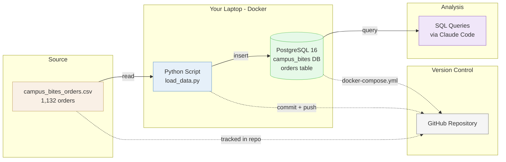

# Mini-Project 1: Local Data Pipeline

## Overview

How to take raw data and build a working pipeline from scratch using AI-assisted development tools. You will go from a CSV file to a queryable PostgreSQL database running on your laptop, version-controlled with git, and pushed to GitHub.

This is the bridge between writing SQL queries (Lessons 01-05) and building the systems that make those queries possible.

## The Scenario

The Campus Bites CEO liked your SQL analysis from the first half of the course:

> "The analysis was great. But I can't keep asking you to write one-off queries every time I have a question. Can you build something the team can use anytime?"

Your mission: take the raw orders data (a CSV export from the old system) and load it into a local PostgreSQL database using Docker, Python, and AI coding tools. By the end, you will have a working pipeline that anyone on the team could clone from GitHub and run.

## What You Are Building

**How it fits together:**
- **Source:** A CSV file exported from the Campus Bites system (the same orders data you queried in Lessons 01-02)
- **Load:** A Python script reads the CSV and inserts it into a PostgreSQL database running in a Docker container on your laptop
- **Query:** You run SQL queries against your local database using Claude Code
- **Version Control:** The entire pipeline (script, data, Docker config) is tracked in a GitHub repository so anyone can clone and run it

## Learning Objectives

By the end of this mini-project, you will be able to:
- **New:** Use Cursor as your code editor
- **New:** Use Claude Code to generate and run code from natural language prompts
- **New:** Run a PostgreSQL database locally using Docker
- **New:** Write a Python script (with AI assistance) to load CSV data into a database
- **Review:** Initialize a git repository and push to GitHub
- **Review:** Write SQL queries to analyze data in your local database

## How the Class Works (Two Sessions)

| Session | What Happens |
|---------|--------------|
| Session 1 | Install tools (Cursor, Claude Code, Docker). Start building the pipeline: create a Docker PostgreSQL database and load the CSV data. |
| Session 2 | Finish the pipeline. Initialize git, push to GitHub. Query the data. Review what Claude Code built. |

## Files in This Lesson

| File | Description |
|------|-------------|
| [mp1-tutorial.md](mp1-tutorial.md) | Step-by-step tutorial for the full mini-project |
| [data/campus_bites_orders.csv](data/campus_bites_orders.csv) | Campus Bites orders data (same data from Lessons 01-02, exported as CSV) |

## Setup

All tools will be installed during Session 1 in class. The tutorial covers each installation step. You will need:
- **Cursor** (free) -- AI-powered code editor
- **Claude Pro subscription** ($20/month) -- powers Claude Code in the terminal
- **Docker Desktop** (free) -- runs the PostgreSQL database locally

## Key Concepts

### From MySQL to PostgreSQL

In Lessons 01-05 you used MySQL. Starting now, you will use PostgreSQL. Your SQL knowledge carries over — the queries are nearly identical. PostgreSQL is the industry standard for data engineering and analytics, and the data warehouse tools you will use later in the course (Snowflake, dbt) are built on its SQL dialect.

### From Analyst to Engineer

In Lessons 01-05, someone else set up the database and you wrote queries against it. Starting now, you are responsible for the full stack: getting the data, storing it, and querying it.

### AI-Assisted Development

You will not write most of the code by hand. Instead, you will describe what you want in plain English and let Claude Code generate it. Your job shifts from writing syntax to understanding what was built and verifying it works correctly.

### The Prompting Workflow

One request at a time. Be specific about what you want. Read what the AI generates before running it. This is the workflow you will use for the rest of the course.

## Lesson Exercise

Complete the full tutorial in [mp1-tutorial.md](mp1-tutorial.md), push your finished repository to GitHub, and submit the GitHub repo link as your Lesson Exercise 06.
