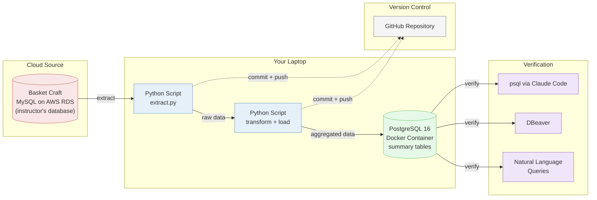

# Mini-Project 02: Cloud Extraction Pipeline

## Overview

How to pull data from a remote database and build a pipeline that transforms it into something useful. You will connect to a cloud MySQL database, extract data, aggregate it, and load it into the local PostgreSQL you built in MP1.

This is the jump from working with data on your laptop to working with data that lives somewhere else. In industry, you almost never have the data sitting in a CSV next to your code. It is in a database, behind a network connection, owned by another team.

## The Scenario

The Basket Craft CEO saw what you built for Campus Bites in MP1 and wants something similar:

> "We have years of order data sitting in our database, but nobody has time to pull reports. Can you set up something that gives us a monthly view of sales by product category? Revenue, order counts, average order size, that kind of thing."

Your mission: connect to the Basket Craft database (running on AWS RDS), extract the data you need, aggregate it into summary tables, and load those into your local PostgreSQL so you can query and analyze them.

## What You Are Building

**How it fits together:**
- **Source:** The Basket Craft MySQL database running on the instructor's AWS RDS instance (the same database from Lessons 01-05)
- **Extract:** A Python script connects to the remote MySQL database and pulls the tables you need
- **Transform + Load:** A Python script aggregates the raw data (GROUP BY, SUM, COUNT, AVG) and loads the summary tables into your local PostgreSQL
- **Verify:** You check the results using psql through Claude Code, DBeaver, and natural language queries
- **Version Control:** Everything is tracked in a GitHub repository

## Learning Objectives

By the end of this mini-project, you will be able to:
- **New:** Install and use the Superpowers plugin for Claude Code
- **New:** Use Superpowers brainstorming to design a pipeline before writing any code
- **New:** Extract data from a remote MySQL database using Python
- **New:** Transform data with aggregations as a lead-in to dimensional modeling
- **Review:** Load data into local PostgreSQL using Python (from MP1)
- **Review:** Verify data using psql, DBeaver, and Claude Code (from MP1)
- **Review:** Version-control with git and push to GitHub (from MP1)

## How the Class Works (Three Sessions)

| Session | What Happens |
|---------|--------------|
| Session 1 | Install Superpowers. Brainstorm the pipeline design. Extract from MySQL, transform, load into local PostgreSQL, and verify. |
| Session 2 | Set up AWS account and CLI. Extract from source RDS, load to Snowflake. Introduction to dbt. *(tutorial coming later)* |
| Session 3 | Build dbt staging and mart models. Star schema in Snowflake. Data quality tests. *(tutorial coming later)* |

## Files in This Lesson

| File | Description |
|------|-------------|
| [mp2-tutorial.md](mp2-tutorial.md) | Step-by-step tutorial for Session 1 (Sessions 2-3 will be added later) |

## Setup

No new installations are needed for Session 1. Everything you set up in MP1 carries over:
- **Cursor** -- your code editor
- **Claude Code** -- AI development tool in the terminal
- **Docker Desktop** -- runs your local PostgreSQL
- **DBeaver** -- database GUI for visual verification

The only thing you need to check: **Docker Desktop must be running** and your local PostgreSQL container from MP1 should be started. The tutorial walks you through this.

## Key Concepts

### From Local to Cloud

In MP1, your data source was a CSV file sitting in your project folder. Now the source is a MySQL database running on AWS, hundreds of miles away. This is how real pipelines work. The data lives in a production system somewhere, and your job is to get it out, clean it up, and put it somewhere useful.

### Design Before You Build

MP1 gave you step-by-step instructions for what to build. MP2 introduces Superpowers, a plugin that adds structured skills to Claude Code. The main one for this session is brainstorming: you describe the business question, and Claude Code automatically starts a design conversation instead of jumping to code. It helps you work through the architecture, data flow, and transformation logic. This produces a blueprint you can follow during the build.

### Aggregation as a Preview of Dimensional Modeling

The summary tables you build in Session 1 have measures (revenue, order count, average order value) grouped by dimensions (product category, month). These are the building blocks of a star schema, which you will learn formally in Sessions 2-3 with dbt. Think of Session 1 as building the intuition that the vocabulary will name later.

### Outcome Variability

Two engineers given the same business question will design different pipelines. They will pick different tables, aggregate differently, and structure their scripts their own way. The tutorial coaches you through the brainstorm but does not prescribe an exact outcome. As long as your pipeline answers the business question, your design is valid.

## Lesson Exercise

Complete the Session 1 tutorial in [mp2-tutorial.md](mp2-tutorial.md), push your finished repository to GitHub, and submit the GitHub repo link as your Lesson Exercise 07.
