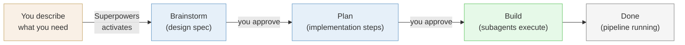
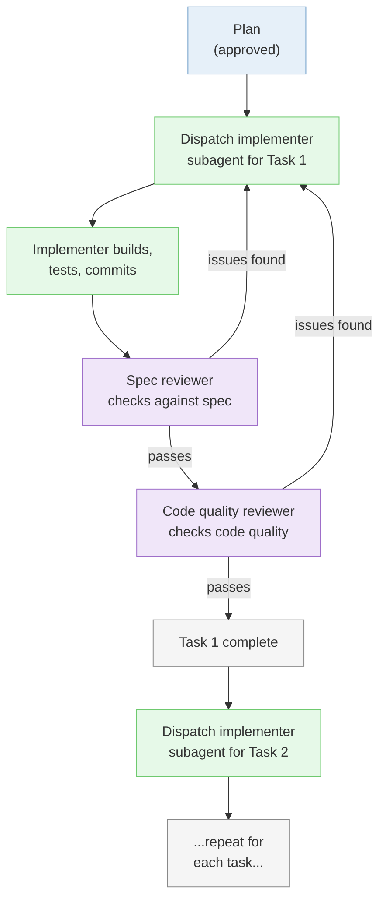

# Mini-Project 02: Cloud Extraction Pipeline Tutorial

This tutorial covers all three sessions of Mini-Project 02. If you fall behind during class, use this tutorial to catch up. Every command and prompt is written out so you can follow along on your own.

## Table of Contents

**Part 1: Extract and Load (Session 01)**

| Step | Topic | What You Will Do |
|------|-------|-----------------|
| 1 | [Create repo and start Claude Code](#step-1-create-github-repo-and-clone-into-cursor) | Set up the project repo, ensure Docker is running, start Claude Code |
| 2 | [Install Superpowers](#step-2-install-superpowers) | Add the Superpowers plugin to Claude Code |
| 3 | [Brainstorm the pipeline](#step-3-brainstorm-the-pipeline) | Design the pipeline with Superpowers brainstorming and a diagram |
| 4 | [Implement the pipeline](#step-4-implement-the-pipeline) | Set up CLAUDE.md, add credentials, let Superpowers build the pipeline |
| 5 | [Verify the data](#step-5-verify-the-loaded-data) | Check the results with psql, DBeaver, and Claude Code |
| 6 | [Update CLAUDE.md](#step-6-update-claudemd) | Run /init to capture the full project context |

**Part 2: Moving to the Cloud (Session 02)**

| Step | Topic | What You Will Do |
|------|-------|-----------------|
| 7 | [Verify AWS setup](#step-7-verify-aws-setup) | Confirm AWS CLI works, configure credentials |
| 8 | [Create RDS via Console](#step-8-create-rds-via-the-aws-console) | Build a cloud PostgreSQL database through the AWS web interface |
| 9 | [Recreate RDS via CLI](#step-9-delete-console-instance-recreate-via-cli) | Delete the Console instance, recreate with one CLI command |
| 10 | [Load raw data into RDS](#step-10-load-raw-data-into-aws-rds) | Extract all Basket Craft tables and load into cloud PostgreSQL |
| 11 | [Verify the data](#step-11-verify-the-loaded-data) | Check results with DBeaver and Claude Code |
| 12 | [Update documentation](#step-12-update-documentation-and-push) | Run /init, update README, commit and push |

**Part 3: Data Warehouse and Transformations (Session 03)** *(coming soon)*

| Step | Topic | What You Will Do |
|------|-------|-----------------|
| 13 | Set up Snowflake | Create trial account, configure warehouse and database |
| 14 | Load data into Snowflake | Move raw data from RDS to Snowflake |
| 15 | Initialize dbt project | Install dbt, connect to Snowflake, create project structure |
| 16 | Build staging models | Clean and rename raw data |
| 17 | Build mart models | Create star schema with fact and dimension tables |
| 18 | Run dbt tests and submit | Validate data quality, final commit and push |

---

## Part 1: Extract and Load (Session 01)

### Step 1: Create GitHub Repo and Clone into Cursor

In MP01, you built a project folder from scratch and added git later. This time you start the professional way: create the GitHub repository first, clone it to your machine, and then start building inside it.

**Why repo-first:** In professional work, you create the repository before writing any code so every change is tracked from the start. This is the workflow you will use for every project from now on.

You also need Docker running, since you will create a new local PostgreSQL container for this project.

**What to do:**

1. Go to [github.com/new](https://github.com/new) and create a new repository:
   - Name it `basket-craft-pipeline`
   - Set visibility to **Public**
   - Under **Add .gitignore**, select **Python** from the dropdown
   - Leave everything else as default (no README, no license)
   - Click **Create repository**

2. On your new repository's GitHub page, click the green **Code** button, make sure **HTTPS** is selected, and click the copy icon to copy the URL.

3. Clone the repo into Cursor. Open a new Cursor window and click **Clone repo** on the welcome screen. Paste the URL you just copied.

   If you do not see the welcome screen, you can also clone from the menu: **File > New Window**, then click **Clone repo**. Or use the command palette (Mac: `Cmd+Shift+P`, Windows: `Ctrl+Shift+P`) and search for "Git: Clone".

   When Cursor asks where to save it, navigate to your `isba-4715` folder inside your home directory (the same parent folder from MP01). Open the cloned folder when prompted.

   Your folder structure should now look like:
   ```
   ~/isba-4715/
   ├── campus-bites-pipeline/     <-- MP01
   └── basket-craft-pipeline/     <-- MP02 (this project)
   ```

4. Open a terminal in Cursor (`` Ctrl+` `` or **Terminal > New Terminal** from the menu bar).

5. Make sure Docker Desktop is open and running. If you do not have it installed (maybe you skipped MP01 or uninstalled it), follow the installation instructions in [MP01 Step 3](../06-local-pipeline/mp01-tutorial.md#step-3-install-docker) before continuing. It takes about 5 minutes.

   If your MP01 container (`campus_bites_db`) is running, stop it first. In Docker Desktop, go to **Containers**, find it, and click the Stop button. Or run `docker stop campus_bites_db` in your terminal. Two PostgreSQL containers cannot use the same port, and both default to 5432.

6. Confirm you are in the correct directory. Your terminal prompt should show `basket-craft-pipeline`. If not, navigate there and then start Claude Code:
   ```bash
   cd ~/isba-4715/basket-craft-pipeline
   claude
   ```
   Claude Code will ask if you trust this folder. Select **Yes, I trust this folder** and press Enter.

7. Set the output style to explanatory mode. Type:
   ```
   /config
   ```
   Use the arrow keys to select **Output style**, press Enter, then select **Explanatory** and press Enter again. This tells Claude Code to explain what it is doing as it works, so you learn the tools instead of just watching code appear. You only need to set this once — it persists across sessions.

**Checkpoint:** Your repo is cloned and open in Cursor. Docker Desktop is running. Claude Code is active in the terminal with explanatory output style.

---

### Step 2: Install Superpowers

In MP01, you used Claude Code with basic prompts: "do this," "build that." You described what you wanted and it generated the code. That works well for straightforward tasks.

But when you are building a pipeline with multiple moving parts (a source database, extraction scripts, transformations, a destination database), it helps to think through the design before writing code. [Superpowers](https://github.com/obra/superpowers) is a plugin for Claude Code that adds structured workflows for exactly this. The main one you will use today is brainstorming, which walks you through a design conversation and produces a blueprint before any code gets written.

**What to do:**

1. In your Claude Code session, install the Superpowers plugin. Type:

   ```
   /plugin install superpowers@claude-plugins-official
   ```

   Follow the prompts to complete the installation.

2. Once installed, verify that it worked by typing `/super` in the Claude Code prompt. You should see autocomplete suggestions that include Superpowers commands like `/using-superpowers`. If you see them, the install worked.

**Why this matters:** Superpowers adds structured skills to Claude Code that activate automatically. When you describe something you want to build, Superpowers will recognize the situation and start a **brainstorming** conversation before jumping to code. You do not need to type a special command — just describe what you need and Claude Code will announce which skill it is using. The two skills we will learn in this course are:
- **Brainstorming** — Design before you build. Have a conversation about what you are trying to accomplish, and end up with a pipeline diagram and a plan. You will use this today.
- **Writing plans** — Break complex work into steps. You will learn this one in Sessions 02-03.

Superpowers has many other skills (debugging, code review, testing, and more), but these two are the ones we will use in class.

In MP01, you told Claude Code *what* to build. With Superpowers, it first discusses *what and why* with you, then builds. Here is the full workflow:



You approve at two checkpoints (after the spec and after the plan), then Superpowers builds autonomously. Over the next few sessions, you will learn progressively more structured ways to work with Claude Code. Each one builds on the last.

**Checkpoint:** Superpowers is installed. You see Superpowers commands in the autocomplete when you type `/super`.

---

### Step 3: Brainstorm the Pipeline

Before writing any code, you are going to design the pipeline. In MP01 Step 5, you let Claude Code ask you questions to explore the problem. That was freeform. This time, Superpowers will automatically activate its brainstorming skill when it sees you describing something you want to build. Instead of jumping to code, Claude Code will start a structured design conversation that produces a **written design spec** — a document that gets saved to your project and committed to git. The spec defines everything needed to build the pipeline: architecture diagram, file structure and responsibilities, table schemas, SQL for aggregations, Docker and credential configuration, error handling, and testing strategy. Because the spec defines every file and its job, implementation in Step 4 is just executing the spec.

Here is the important part: **your design will probably look different from the instructor's and from your classmates'.** That is how real engineering works. Two people given the same business question will make different decisions about which tables to pull, how to aggregate, and how to structure the scripts. As long as your pipeline answers the business question, your design is valid.

**What to do:**

1. In Claude Code, type:

   ```
   I need to build a data pipeline. The Basket Craft team wants a
   monthly sales dashboard with revenue, order counts, and average
   order value by product category and month.

   Source: Basket Craft MySQL database.
   Destination: local PostgreSQL in Docker.

   Create a diagram of the pipeline, then help me plan
   the extraction and transformation.
   ```

   Claude Code will announce that it is using the brainstorming skill. This is Superpowers at work — it recognized that you are describing something you want to build and activated the right workflow automatically.

   Claude Code may also offer to open a **visual companion** in your browser for showing diagrams and mockups. If it asks, say yes and open the `localhost` URL it provides. If it does not offer, that is fine — the brainstorm will work in the terminal either way.

2. Claude Code will start a design conversation and ask about your setup. The brainstorm is a back-and-forth conversation, not a single prompt. Claude Code will ask you questions one at a time. Answer each one, and if it suggests something you do not understand, ask it to explain. A typical brainstorm takes 4-8 exchanges before producing the final diagram and plan.

   Be honest about your setup. If something from MP01 is broken or missing, tell the brainstorm. It will include fix-it steps in the pipeline design. That is one of the advantages of designing before building.

   Here is how to respond to common questions:

   - **When it asks about the source database:** Tell it the connection details you have been using all semester for the Basket Craft MySQL database. The credentials are the same ones from Lessons 01-05. The instructor will share them in the Zoom chat and the Teams channel.

   - **When it asks about the destination:** Tell it you need a local PostgreSQL database running in Docker for this project. The brainstorm will include a `docker-compose.yml` and container setup as part of the pipeline design. This is a new container separate from your MP01 project.

   - **When it asks about the transformation:** Explain that you need aggregated summary tables for a sales dashboard. Revenue, order counts, and average order value grouped by product category and month.

   - **When it asks about anything else:** Answer based on what you know. If you are unsure about something, say so. That is what the brainstorm is for.

3. The brainstorm will present the design in sections for you to review and approve. The final written spec will include:
   - A **pipeline diagram** (source -> extract -> transform -> load -> destination)
   - **File structure** and what each script is responsible for
   - **Table schemas** and SQL for aggregations
   - **Docker and credential configuration**
   - **Error handling** and **testing strategy**

   Review each section critically. If it misses something (for example, it only extracts one table when you need data from both orders and products to get category information), push back: "I think we also need the products table to get category names. Can you update the spec?" The brainstorm is a conversation, and you can steer it.

4. If the brainstorm has not yet produced a pipeline diagram, ask for one:

   ```
   Create a diagram of the pipeline we just designed.
   ```

5. Once you approve the final spec, Superpowers will write it to a file in your project (typically in a `docs/` folder) and commit it.

6. **Open the spec file in Cursor and read it.** This is the blueprint for your entire pipeline. Check that it makes sense to you:
   - Does the pipeline diagram match what you discussed?
   - Do the table schemas include the columns you expect?
   - Does the aggregation SQL produce the metrics the business question asks for (revenue, order counts, avg order value by category and month)?
   - Are the file names and responsibilities clear?

   If something looks wrong, tell Claude Code what to fix. The spec is easier to correct now than after the code is written. Once you are satisfied, Superpowers will transition to planning and implementation in Step 4.

**Your design vs. the instructor's:** The instructor will show their pipeline design during class. Your design may extract different tables, aggregate in a different order, or structure the scripts differently. The grading criteria is not "does it match the instructor's approach" but "does it answer the business question: monthly revenue, order counts, and average order value by product category?"

**Why this matters:** In MP01, the tutorial told you exactly what to build. That was appropriate for learning the tools. Now you are learning a harder skill: deciding what to build. The brainstorming conversation is practice for the design thinking you will need for your independent project and for real engineering work after graduation.

Superpowers may have already committed the spec for you. If not, commit and push now:

```
Commit all files and push to GitHub.
```

**Checkpoint:** You have a written design spec committed to your project and pushed to GitHub. It defines every file, schema, and configuration needed to build the pipeline. Superpowers is ready to transition into planning and building.

---

### Step 4: Implement the Pipeline

Your brainstorm produced a design spec. Now Superpowers will transition into planning and execution.

**Spec vs. plan:** The spec is *what* to build and why — the design decisions, schemas, architecture, and trade-offs. It is the agreement on what the system looks like when it is done. You wrote this during brainstorming. The plan is *how* to build it, step by step — the exact files to create, the exact code to write, the exact commands to run, in what order. A spec could be implemented many different ways. The plan picks one way and spells it out so precisely that someone (or an agent) with zero context could follow it mechanically.

Superpowers writes the implementation plan based on the approved spec, then builds using **subagent-driven development**. Instead of doing everything in one long conversation, Claude Code spawns fresh mini-agents (subagents) for each task:



Each subagent gets just the context it needs for its task — no conversation history bloat. You will see messages like "Dispatching implementer for Task 1..." as it works through the plan. You will also see a **Base SHA** at the start — this is a git commit hash that Superpowers saves as a snapshot before building, so it can roll back if something goes wrong. You do not need to prompt for each piece — just watch it work and answer questions if it asks.

Before it starts building, there are two things you need to set up manually.

**What to do:**

1. Create a `CLAUDE.md` file for your project. This is a file in your project root that Claude Code reads at the start of every session. It contains persistent instructions for this project — like project-level preferences that you set once instead of repeating yourself. Tell Claude Code:

   ```
   Create a CLAUDE.md file with this instruction:
   Use a Python virtual environment to manage dependencies.
   ```

   This tells Claude Code to create and use a virtual environment automatically when it installs packages or runs scripts. You can add more project conventions to this file later.

2. Create a `.env` file in your project root. Right-click the file explorer, select **New File**, name it `.env`, and paste the credentials block the instructor shares in Zoom chat / Teams. It should look something like:

   ```
   MYSQL_HOST=...
   MYSQL_PORT=3306
   MYSQL_USER=...
   MYSQL_PASSWORD=...
   MYSQL_DATABASE=basket_craft
   ```

   Confirm that `.env` is listed in your `.gitignore` (the Python template you selected when creating the repo should already include it). This keeps credentials out of GitHub.

3. Approve the plan and let Superpowers build. After the brainstorm spec is approved, Superpowers will present an implementation plan. Review it, then approve it. Claude Code will start building: writing extraction scripts, transformation scripts, Docker configuration, and installing dependencies based on the approved spec.

   Let it work. If it asks questions, answer them. If it hits an error (connection issues, missing packages), it will fix and retry.

4. While Superpowers builds, confirm Docker is ready. Docker Desktop should still be open from Step 1, and your MP01 container should be stopped so port 5432 is free.

**After the build completes, review what was built:**

5. **Verify credentials stayed out of the code.** Open the generated Python scripts in Cursor and look for the database password. It should not appear in any `.py` file — only in the `.env` file. If it does:

   ```
   Move the credentials out of the script and read from the .env file.
   ```

6. Review the generated code in Cursor. You should be able to identify:
   - How the extraction script connects to the MySQL database and which tables it pulls
   - The aggregation logic in the transformation: GROUP BY, SUM, COUNT, AVG
   - How data flows from extraction to transformation to loading into PostgreSQL

**Your file structure vs. your classmates':** Your brainstorm may have produced a different file structure than others. Some pipelines use one script for everything, others separate extraction, transformation, and loading into different files. What matters is that the pipeline extracts, transforms, and loads correctly.

**What you are really building:** The summary tables you produce have measures (revenue, order count, average order value) grouped by dimensions (product category, month). If that sounds like it has a formal name, it does. These are the building blocks of a star schema, the standard structure for data warehouses. You will learn the vocabulary (fact tables, dimension tables, staging, marts) in Sessions 02-03 with dbt. For now, just notice the pattern: measures grouped by dimensions.

Superpowers may have already committed during the build. If not, commit and push now:

```
Commit all files and push to GitHub.
```

**Checkpoint:** The pipeline has been built and run. Extraction pulled data from the Basket Craft MySQL database, transformation aggregated it, and loading put the summary tables into your local PostgreSQL. Claude Code confirms success with row counts or a summary. Your work is pushed to GitHub.

---

### Step 5: Verify the Loaded Data

The pipeline ran. But did it work correctly? You will check the loaded data three different ways. Each catches different kinds of problems.

**What to do:**

**Method 1: psql via Claude Code**

1. Ask Claude Code to connect to your local PostgreSQL and check the data:

   ```
   Connect to my local PostgreSQL using psql. Show me the tables,
   row counts, and a sample of rows from each table.
   ```

2. Review the output. Do the table names match what your brainstorm planned? Do the row counts seem reasonable for monthly aggregations?

**CLI through Claude Code:** Claude Code can run CLI tools like `psql` on your behalf — you ask a question, and it handles the connection, the SQL, and the output formatting. You do not need to memorize psql commands. You will use this same pattern with the AWS CLI, dbt, and Snowflake CLI in later mini-projects.

**Method 2: DBeaver**

1. Open DBeaver and create a new PostgreSQL connection. Click **New Database Connection** (or **Database > New Database Connection**), select **PostgreSQL**, and fill in the connection details from the `docker-compose.yml` that the brainstorm created in your project folder:
   - Host: `localhost`
   - Port, database name, username, and password: check your `docker-compose.yml`
   - Click **Test Connection** to verify, then **Finish**

   This is a different connection from MP01 — this project has its own container with its own credentials.

2. Navigate to your database > **Schemas > public > Tables**. You should see the summary tables that your pipeline created.

3. Double-click a table to browse the data. Do the numbers look reasonable? If you see monthly revenue in the hundreds of thousands, does that match your intuition about Basket Craft's order volume?

**Method 3: Claude Code natural language queries**

1. Back in Claude Code, ask analytical questions about the loaded data:

   ```
   What product category had the highest total revenue? Which month had the most orders?
   ```

2. Compare the answers to what you see in DBeaver. They should match.

3. Try a question that directly tests the business requirement:

   ```
   Show me the average order value by product category for each month, sorted by month.
   ```

   This is the core of what the Basket Craft team asked for. If this query returns sensible results, your pipeline works. Notice the structure of what you built: numerical measures (revenue, order count, average order value) organized by descriptive categories (product category, month). This pattern has a name you will learn in Sessions 02-03.

**Three tools, three purposes:**

| Tool | Best for | When to use |
|------|----------|-------------|
| psql via Claude Code | Quick checks, row counts, schema inspection | First pass — did the tables get created with the right structure? |
| DBeaver | Browsing data visually, spotting obvious issues | Second pass — does the data look right when you eyeball it? |
| Claude Code natural language | Analytical questions, testing the business logic | Final pass — does the pipeline actually answer the business question? |

You used all three of these in MP01. The workflow is the same here, just with different data. Get comfortable switching between them — you will use the same approach in your independent project.

**Commit your work.** Now that the pipeline is verified, commit everything. Ask Claude Code:

```
Commit all project files and push to GitHub.
```

**Checkpoint:** The aggregated data is verified through all three methods. You can see monthly revenue, order counts, and average order value by product category. The pipeline answers the business question the Basket Craft team asked for. Your work is committed to git.

---

### Step 6: Update CLAUDE.md

In Step 4, you created a `CLAUDE.md` with a single instruction about virtual environments. Now that the pipeline is fully built, update it to capture the full project context. This way, the next time you (or anyone) starts Claude Code in this project, it will already know what the project is, how it is structured, and how to work with it.

**What to do:**

1. In Claude Code, type:

   ```
   /init
   ```

   This tells Claude Code to scan your project and update the `CLAUDE.md` file. It will look at your scripts, Docker config, database setup, and directory structure to build a complete project summary.

2. Open `CLAUDE.md` in Cursor and review what it generated. It should include the project purpose, file descriptions, database connection details, and how to run the pipeline.

3. Create a `README.md` for your project. Tell Claude Code:

   ```
   Create a README.md that explains what this project is, how to
   set it up, and how to run the pipeline.
   ```

   A good README means anyone who visits your GitHub repo can understand what they are looking at. This is the first thing recruiters and collaborators see.

4. Commit and push:

   ```
   Commit all files and push to GitHub.
   ```

**Why this matters:** A good `CLAUDE.md` saves you time in every future session. Instead of re-explaining your project, Claude Code reads the file and picks up where you left off. This is especially useful in Sessions 02-03, where you will build on top of what you built today.

**Checkpoint:** Your `CLAUDE.md` reflects the full project and your `README.md` explains the project to anyone visiting the repo. Both are committed and pushed to GitHub.

---

## Homework: Prepare for Session 02

Before the next class, complete these two setup tasks. You will need both for Session 02, where you set up your own AWS infrastructure.

1. **Create an AWS account.** Go to [aws.amazon.com](https://aws.amazon.com/) and create a free-tier account. You will need a credit card on file, but we will only use free-tier resources in this course. If you already have an AWS account from another class, you are set.

2. **Install the AWS CLI.** Follow the instructions for your operating system:

   **Mac:**
   ```bash
   brew install awscli
   ```

   **Windows:** Download and run the installer from [aws.amazon.com/cli](https://aws.amazon.com/cli/)

   Verify the installation by running:
   ```bash
   aws --version
   ```

   You should see a version number like `aws-cli/2.x.x`.

These tools are prerequisites for Session 02. We cannot proceed without them, so do not wait until the day of class.

---

## Part 2: Moving to the Cloud (Session 02)

### Step 7: Verify AWS Setup

Session 02 picks up in the same `basket-craft-pipeline` project from Session 01. Before building anything in the cloud, confirm the AWS tools from homework are working.

**What to do:**

1. Open your `basket-craft-pipeline` project in Cursor (the same repo from Session 01).

2. Open a terminal (`` Ctrl+` `` or **Terminal > New Terminal**) and start Claude Code:
   ```bash
   claude
   ```
   Trust the folder if prompted.

3. Check that the AWS CLI is installed. In your terminal (outside Claude Code), run:
   ```bash
   aws --version
   ```
   You should see `aws-cli/2.x.x`. If not, install it now — Mac: `brew install awscli`, Windows: download from [aws.amazon.com/cli](https://aws.amazon.com/cli/).

4. Configure your AWS credentials. In your terminal (not inside Claude Code), run:
   ```bash
   aws configure
   ```
   Enter your AWS Access Key ID and Secret Access Key when prompted. For region, enter `us-west-2` (or your preferred region). For output format, enter `json`.

   If you do not have an access key, log in to the AWS Console at [console.aws.amazon.com](https://console.aws.amazon.com/), go to **IAM > Users > your user > Security credentials > Create access key**.

5. Confirm your credentials work:
   ```bash
   aws sts get-caller-identity
   ```
   You should see your AWS account ID, user ARN, and user ID returned as JSON.

**AWS credentials vs project credentials:** This project uses two separate sets of credentials. AWS credentials (access key and secret key) are stored in `~/.aws/credentials` by `aws configure`. They live at the machine level — they identify you to AWS and never belong in your project files. RDS database credentials (username and password for your cloud database) go in your project's `.env` file, the same as the MySQL credentials from Session 01. Never put AWS access keys in `.env` or any file tracked by git.

**Checkpoint:** `aws sts get-caller-identity` returns your AWS account info. Claude Code is running in your `basket-craft-pipeline` project.

---

### Step 8: Create RDS via the AWS Console

You are going to create a cloud database two ways. First through the AWS Console (the web interface) so you understand what every setting does. Then in Step 9, you will delete it and recreate the same thing with one CLI command. The Console creation is deliberately slow — the point is to feel the friction so the CLI speed hits harder.

**What to do:**

1. Open the AWS Console in your browser: [console.aws.amazon.com](https://console.aws.amazon.com/). Sign in with your AWS account.

2. Navigate to **RDS**: search for "RDS" in the top search bar, or find it under **Services > Database > RDS**.

3. Click **Create database** and configure:
   - **Choose a database creation method:** Standard create
   - **Engine type:** PostgreSQL
   - **Engine version:** PostgreSQL 16 (latest 16.x available)
   - **Templates:** Free tier
   - **DB instance identifier:** `basket-craft-console`
   - **Master username:** `student`
   - **Master password:** `go_lions` (confirm it)
   - **DB instance class:** `db.t3.micro` (should be pre-selected with Free tier template)
   - **Storage:** 20 GB, General Purpose SSD (gp2)
   - **Connectivity:** select **Yes** for Public access
   - **VPC security group:** Create new, name it `basket-craft-sg`
   - Leave other settings as default

4. Click **Create database**. Provisioning takes 5-10 minutes. While you wait, the instructor will explain what each setting does.

5. Once the status shows **Available**, click on the instance name. Go to the **Connectivity & security** tab and copy the **Endpoint** (it looks like `basket-craft-console.xxxx.us-west-2.rds.amazonaws.com`).

6. Edit the security group to allow connections. Click the security group link under **Connectivity & security**, go to **Inbound rules > Edit inbound rules > Add rule**:
   - Type: **PostgreSQL**
   - Source: **Anywhere-IPv4** (0.0.0.0/0)
   - Click **Save rules**

7. Open DBeaver and create a new PostgreSQL connection:
   - Host: paste the endpoint you copied
   - Port: `5432`
   - Database: `basket_craft`
   - Username: `student`
   - Password: `go_lions`
   - Click **Test Connection** to verify, then **Finish**

8. You should see an empty `basket_craft` database. This is a PostgreSQL database running in the cloud, not on your laptop.

**Not for production:** Public access and an open security group (0.0.0.0/0) are fine for a free-tier learning database. In production, you would restrict access to specific IP addresses or use a VPN. We are keeping it simple so you can connect from campus, home, or anywhere.

**Checkpoint:** Connected to the Console-created RDS instance (`basket-craft-console`) in DBeaver. Empty database, accessible from your machine.

---

### Step 9: Delete Console Instance, Recreate via CLI

That took a while. Every dropdown, every setting, the provisioning wait. Now you are going to do the same thing with one command. Once AWS knows who you are (`aws configure`), Claude Code can create, modify, and delete cloud resources on your behalf.

**What to do:**

1. In Claude Code, delete the Console-created instance:

   ```
   Delete my AWS RDS instance called basket-craft-console.
   Skip the final snapshot.
   ```

2. Now create a new one with the same settings:

   ```
   Create an AWS RDS PostgreSQL 16 instance:
   - Instance identifier: basket-craft-db
   - Database name: basket_craft
   - Master username: student
   - Master password: go_lions
   - Instance class: db.t3.micro
   - Storage: 20 GB
   - Publicly accessible: yes
   - Security group: basket-craft-sg
   ```

3. Claude Code will run the `aws rds create-db-instance` command. Compare the time it took to type this prompt vs the 10 minutes you spent in the Console.

4. Wait for the instance to become available. Ask Claude Code to check:

   ```
   Check if my basket-craft-db RDS instance is available yet.
   ```

5. Once available, get the endpoint:

   ```
   What is the endpoint for my basket-craft-db RDS instance?
   ```

6. Open DBeaver, create a new PostgreSQL connection using the new endpoint (same credentials: `student` / `go_lions`, database `basket_craft`). Test the connection.

**Why CLI matters:** The Console is good for learning what settings exist. The CLI is good for everything else: faster, repeatable, scriptable, and auditable. You will use CLIs for most cloud operations from here on.

**Checkpoint:** Console instance deleted. CLI-created instance (`basket-craft-db`) is running and connected in DBeaver.

---

### Step 10: Load Raw Data into AWS RDS

You have a cloud database. Now fill it with data. You will extract all raw Basket Craft tables from the instructor's MySQL database and load them into your AWS RDS PostgreSQL. This is the same extraction you did in Session 01, but with a different destination. In Session 01 the data went to your laptop. Now it goes to the cloud.

**What to do:**

1. Add your RDS credentials to the `.env` file. Open it in Cursor and add these lines (keep the existing MySQL credentials):

   ```
   RDS_HOST=basket-craft-db.xxxx.us-west-2.rds.amazonaws.com
   RDS_PORT=5432
   RDS_USER=student
   RDS_PASSWORD=go_lions
   RDS_DATABASE=basket_craft
   ```

   Replace the `RDS_HOST` value with your actual endpoint from Step 9.

2. Tell Claude Code to load the data:

   ```
   Extract all raw tables from the Basket Craft MySQL database and
   load them into my AWS RDS PostgreSQL. Read the MySQL and RDS
   credentials from the .env file. Load all 8 tables as-is — no
   transformations, just raw data.
   ```

3. This is a direct prompt, not a brainstorm. In Session 01, you brainstormed because there were design decisions (what to extract, how to transform, what the file structure should look like). Here the task is clear: same source, new destination. Knowing when to brainstorm vs when to give a direct instruction is a prompting skill.

4. Let Claude Code work. It will adapt your existing extraction scripts or write new ones. If it asks questions, answer them. If it hits connection errors, let it fix and retry.

**Raw data for a reason:** You are loading raw, untransformed data. In Session 03, you will use dbt to transform this raw data into a star schema (fact and dimension tables). This is the ELT pattern you learned in Session 01: raw data goes into the warehouse first, then you transform it there. Loading raw data now means you have the full source to work with later.

**Checkpoint:** All 8 raw Basket Craft tables are loaded into the AWS RDS. Row counts per table match the source MySQL database.

---

### Step 11: Verify the Loaded Data

Same verification habit from Session 01 — check the data before calling it done. This time the database is remote.

**What to do:**

**Method 1: Claude Code**

1. Ask Claude Code to check the data:

   ```
   Connect to my AWS RDS PostgreSQL and show me all tables
   with their row counts.
   ```

2. Compare the row counts to what you expect from the source MySQL database.

**Method 2: DBeaver**

1. In DBeaver, refresh your connection to the `basket-craft-db` instance (right-click > **Refresh**).

2. Navigate to **basket_craft > Schemas > public > Tables**. You should see all 8 tables.

3. Open a few tables and browse the data. Does it look like the same Basket Craft data you queried in Lessons 01-05?

**Method 3: Claude Code natural language queries**

1. Ask an analytical question about the data in your RDS:

   ```
   Using my AWS RDS, what are the top 5 products by total revenue?
   ```

2. Compare the answer to what you would expect from the source data.

**Checkpoint:** Data verified. All 8 tables present in the AWS RDS with row counts matching the source MySQL database.

---

### Step 12: Update Documentation and Push

The pipeline works. Your data is in the cloud. Now update your project documentation to reflect what you built. This is the same pattern from Session 01: after every implementation session, run `/init` and update the README. Documentation should always reflect the current state of the project.

**What to do:**

1. Run `/init` in Claude Code to update the `CLAUDE.md` file. It will detect the new AWS RDS connection and scripts.

2. Review the updated `CLAUDE.md` in Cursor. It should now include both the local Docker PostgreSQL and the AWS RDS.

3. Update the README:

   ```
   Update the README.md to reflect that the project now includes
   an AWS RDS PostgreSQL database with raw Basket Craft data.
   ```

4. Commit and push:

   ```
   Commit all files and push to GitHub.
   ```

**Why documentation matters:** Every time you add infrastructure or change how the project works, update the docs. Your future self, your classmates, and recruiters looking at your GitHub will thank you. A repo with outdated docs is worse than a repo with no docs — at least no docs is honest.

**Checkpoint:** CLAUDE.md reflects the AWS RDS addition. README is updated. All work is committed and pushed to GitHub.

---

## Homework: Prepare for Session 03

Sign up for a Snowflake trial account before the next class.

1. Go to [signup.snowflake.com](https://signup.snowflake.com/) and create a free trial account. You only need a valid email address — no credit card required. The trial lasts 30 days.

2. During signup, select:
   - **Cloud provider:** AWS
   - **Region:** US West (Oregon) — or the closest region to your location
   - **Edition:** Standard

3. After signing up, log in to your Snowflake account and confirm you can see the Snowflake web interface (Snowsight).

This is required for Session 03. We cannot proceed without it.

---

## Part 3: Data Warehouse and Transformations (Session 03)

*Coming soon.* This session covers Snowflake setup, loading data from your AWS RDS into Snowflake, and building dbt models (staging + marts) with a star schema.

**Before this session:** Complete the [homework from Session 02](#homework-prepare-for-session-03) (Snowflake trial account signup).

---

## Submission

Submission details will be added when Sessions 02-03 are complete. MP02 is one lesson exercise covering all three sessions — you will submit your GitHub repository link as **Lesson Exercises 07** after finishing the full tutorial.
