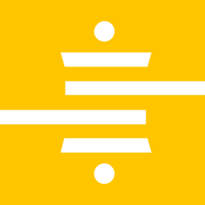

<!-- _class: accent -->

# Snowflake Load

**Session 03** · ISBA 4715 · MP02

The **L** in ELT — move Basket Craft raw tables from AWS RDS into a cloud data warehouse.

---

# PostgreSQL saves orders; Snowflake scans millions

  
PostgreSQL <small>OLTP · row-oriented one order at a time</small>

  
Snowflake <small>OLAP · columnar millions of rows per query</small>

Different databases for different jobs — operational versus analytical.

---

<!-- _class: dark -->

# Storage and compute are separate

  
Storage

  
Compute

The idea that explains everything else about Snowflake.

---

# Storage: cheap bytes, always on

  
column: customer_id

  
column: order_date

  
column: order_value

- Columnar files in cloud storage
- Pay for bytes stored
- Always available, low cost

---

# Compute bills per second, suspends when idle

  
XS <small>daily default</small>

  
→

  
L <small>big transform</small>

  
→

  
XS <small>back to cheap</small>

- Cluster that runs SQL
- Pay per second running
- Zero cost when suspended
- Resize with one setting

---

# Separation lets cost and speed scale independently

  
XS warehouse <small>BI</small>

  
L warehouse <small>dbt</small>

  
Suspended <small>$0</small>

  
Shared storage · always on · never resized

- Auto-suspend stops the meter
- Resize up, drop back down
- dbt jobs stay free-tier fast

---

<!-- _class: dark -->

# Today you only do the "L"

E<strong>L</strong>T

- Create warehouse, database, `raw` schema
- Copy RDS tables into `raw`
- No cleaning, no transforms
- Session 04 builds the star schema

---

# In industry, managed tools land raw data

  

  
Airbyte

  
Stitch

  

  
Matillion

- Click-configure a source
- Scheduled loads, schema drift, retries
- Priced by row volume
- Custom Python loaders are rare in production

---

# Writing it yourself teaches what Fivetran hides

  
<small>wrapper · opaque one "connect" button</small>

  
Your loader <small>write_pandas · COPY INTO every building block visible</small>

- Debug Fivetran when it breaks
- Build loaders for systems without connectors
- Know the building blocks, not just the wrapper

---

# RDS → Python → warehouse → raw

  
AWS RDS <small>PostgreSQL (Session 02)</small>

  
→

  
Python loader <small>write_pandas truncate-and-reload</small>

  
→

  

    
Snowflake account

    

      
basket_craft_wh <small>virtual warehouse (compute)</small>

      
→

      
raw schema <small>orders, order_items, products, customers</small>

    

  

Every query travels through a warehouse to reach a schema.

**Session 04:** dbt reads `raw`, builds `staging` and `mart`.

---

<!-- _class: steps -->

# Seven steps to a populated raw schema

| # | Step | What you do |
|---|---|---|
| 13 | Verify account | Region, edition |
| 14 | Create objects | Warehouse, database, `raw` schema |
| 15 | Store credentials | Snowflake vars in `.env` |
| 16 | Brainstorm the loader | Surface design decisions first |
| 17 | Implement the loader | Claude Code writes it, official package |
| 18 | Run and verify | Row counts match RDS |
| 19 | Commit and push | Update `CLAUDE.md`, ship |

---

<!-- _class: accent -->

# Now open the tutorial and jump to Step 13

Tutorial: [`mp02-tutorial.md` → Step 13](mp02-tutorial.md#step-13-verify-your-snowflake-account)
