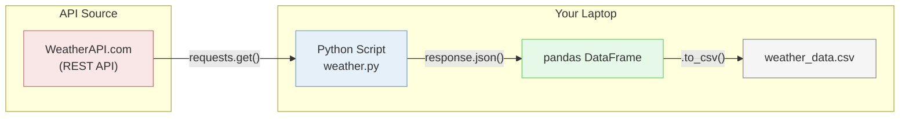

# Lesson 08: API Data Collection

## Overview

How to pull data from web APIs using Python. APIs are how you get data from external systems — the first source type required for the portfolio project. The arc: start by hand-coding API calls, then use Claude Code to scale up with loops and bulk collection.

## The Scenario

Your portfolio project requires an API data source for Milestone 01. Before you can build a pipeline, you need to know how to pull data from an API and collect enough of it to analyze. Today you learn the pattern: request, parse, loop, save.

## What You Are Building

**How it fits together:**
- **API Source:** WeatherAPI.com is a free REST API that returns weather data as JSON. It stands in for whatever external API your portfolio project uses.
- **Python Script:** `weather.py` makes HTTP requests to the API, parses the JSON response, and organizes the data.
- **pandas DataFrame:** The parsed data goes into a DataFrame for easy manipulation and inspection.
- **CSV:** The DataFrame is saved to a CSV file, a portable output you can load into a database or hand off to another pipeline step.

## Learning Objectives

By the end of this lesson, you will be able to:
- **New:** Understand what APIs are, how REST works, and what JSON looks like
- **New:** Get an API key and make your first API call with Python `requests`
- **New:** Parse nested JSON responses and extract specific fields
- **New:** Use loops to collect bulk data from an API (multiple locations, multiple days)
- **New:** Use Claude Code to extend API scripts with iteration patterns
- **Review:** Save structured data to a pandas DataFrame and CSV (from MP01)

## How the Class Works (One Session)

| Part | What Happens |
|------|--------------|
| Part 01 | API concepts: what they are, REST basics, JSON, API keys (~20 min, slides) |
| Part 02 | Weather API by hand: get a key, make a call, parse JSON (~30 min, live code) |
| Part 03 | Loops + bulk collection: multiple cities, multi-day forecast, save to CSV (~25 min, AI-assisted) |
| Part 04 | Project connection: find APIs for your domain with Claude Code (~15 min) |

## Files in This Lesson

| File | Description |
|------|-------------|
| [mp03-tutorial.md](mp03-tutorial.md) | Step-by-step tutorial for the full session |
| [slides.md](slides.md) | MARP slide deck for Part 01 (API concepts) |
| [spotify-tutorial.md](spotify-tutorial.md) | Async homework: Spotify playlist generator tutorial |

## Setup

No new installations needed. You should already have Cursor, Claude Code, Python 3, `requests`, and `pandas` from earlier mini-projects. The one thing you will set up during class: a free account at weatherapi.com. Step 01 of the tutorial walks you through it.

## Key Concepts

### APIs as Data Sources

In the first half of the course, you queried data that was already in a database. In the real world, data often lives behind APIs. An API is a URL you call with specific parameters and it returns structured data, usually JSON. Calling that API is step one of any pipeline that pulls from an external source.

### The Request-Parse-Loop Pattern

Every API integration follows the same three steps: make a request, parse the response, loop to get enough data. One call gets you one data point. A loop gets you a dataset. You will see this same pattern in the Spotify tutorial later in the week.

### Hand-Code First, Then Automate

You will write your first API calls by hand so you understand what each line does. Then you will use Claude Code to scale up with loops and bulk collection. The goal is not to memorize syntax. It is to understand the pattern well enough to direct Claude Code and verify what it produces.

## Lesson Exercise

Complete the full tutorial in [mp03-tutorial.md](mp03-tutorial.md), push your finished `weather-api-pipeline` repository to GitHub, and submit the GitHub repo link as your Lesson Exercises 08. Also complete the Spotify playlist generator tutorial (assigned Wednesday, due over the weekend).
