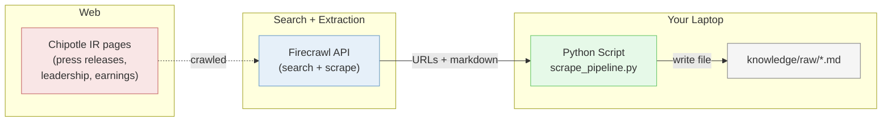
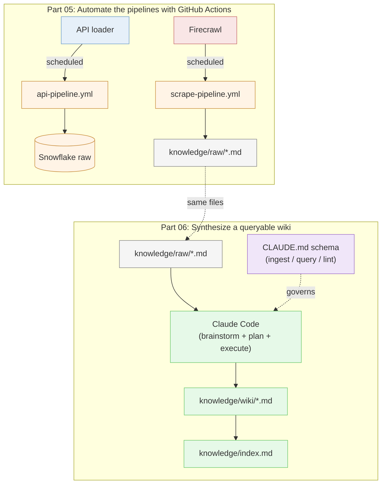

# Lesson 09: Scrape Pipeline

## Overview

A two-session lesson. Session 01 collects unstructured web content into [your portfolio project](https://github.com/LMU-ISBA/isba-4715-f26/tree/main/project)'s `knowledge/raw/` using **[Firecrawl](https://firecrawl.dev)**'s search endpoint and the Firecrawl MCP server. Session 02 automates both your API and scrape pipelines with GitHub Actions, then turns the scraped sources into a queryable knowledge base wiki Claude Code can query against your job posting and role.

## The Scenario

Your portfolio project needs both a structured pipeline (API → Snowflake) and a knowledge base (scrape → `knowledge/raw/` → wiki) by Milestone 02. Session 01 teaches the manual collection pattern (**search, scrape, save**) and the MCP shortcut. Session 02 puts both pipelines on schedule with GitHub Actions and turns the scraped corpus into a wiki organized around the role you're targeting.

## What You Are Building

### Session 01: Manual scrape pipeline

**How it fits together:**
- **Firecrawl:** One `search` call runs a web query and scrapes each result page as markdown. No separate search service needed.
- **Python Script:** Wraps the search call in a short script that writes each result to disk.
- **`knowledge/raw/`:** Where the scraped markdown files live. These feed the knowledge base in your portfolio project.

### Session 02: Automated pipelines + queryable wiki

**How it fits together (Session 02):**
- **GitHub Actions workflows:** `api-pipeline.yml` and `scrape-pipeline.yml` run on schedule, with manual triggers kept available for testing.
- **Snowflake raw:** the API workflow lands rows here for downstream dbt and dashboard work.
- **`knowledge/raw/`:** the scrape workflow commits new markdown files into your repo, growing the corpus over time.
- **Claude Code (synthesis):** reads `knowledge/raw/`, follows the schema in `CLAUDE.md`, and writes wiki pages plus a categorized index.
- **`knowledge/wiki/` + `index.md`:** the queryable layer Claude Code searches first when answering domain questions.
- **CLAUDE.md schema:** the contract documenting ingest, query, and lint operations. Tested by watching what files Claude Code actually opens.

## Learning Objectives

By the end of this lesson, you will be able to:

**Session 01:**
- **New:** Tell the difference between a chat-tool web search (Claude Code's `WebSearch`) and an API search (Firecrawl): one is for humans reading, one is for pipelines parsing
- **New:** Use Firecrawl's unified `search` endpoint to discover URLs and extract markdown in one call
- **New:** Write scraped content as markdown files into a `knowledge/raw/` folder structured for Claude Code ingestion
- **New:** Install and invoke the Firecrawl MCP server inside Claude Code
- **New:** Know what an SDK is, and understand why this lesson uses raw `requests` instead of the Firecrawl SDK
- **Reinforce:** `.env` + `python-dotenv` secrets pattern (from the async Spotify tutorial)
- **Reinforce:** Create-repo-from-scratch workflow (from MP02/MP03)

**Session 02:**
- **New:** Build a GitHub Actions workflow with `workflow_dispatch` and `schedule:` triggers, secrets configured via Settings → Secrets and variables → Actions
- **New:** Recognize the difference between workflows that write to a warehouse (API → Snowflake) and workflows that commit files back to the repo (scrape → `knowledge/raw/`, requires `permissions: contents: write`)
- **New:** Run the full Superpowers loop (brainstorming → writing-plans → executing-plans) twice in one session
- **New:** Design a knowledge base wiki scoped to your job posting, not just your domain
- **New:** Document a CLAUDE.md "Knowledge base schema" covering ingest, query, and lint operations, then verify Claude Code follows it
- **Reinforce:** Brainstorm-before-build pattern from MP02 Session 01

## How the Class Works (Two Sessions, 100 min each)

### Session 01 (Wed Apr 22): Scrape Pipeline

| Part | What Happens |
|------|--------------|
| Part 01 | Scraping concepts: what it is, etiquette, Firecrawl's unified search, MCP intro (~20 min, slides) |
| Part 02 | Python pipeline: Firecrawl search + scrape + save to `knowledge/raw/` (~25 min, live code, after a ~10 min setup block) |
| Part 03 | MCP upgrade: install Firecrawl MCP, replicate the pipeline via one prompt (~15 min) |
| Part 04 | Project connection: scrape at least one source into your portfolio project (~20 min) |

### Session 02 (Mon Apr 27): Automate and Synthesize

| Part | What Happens |
|------|--------------|
| Part 05 | Automate the pipelines: brainstorm + plan + build the API and scrape workflows, then schedule them (~55 min) |
| Part 06 | Build the knowledge base wiki: design + generate wiki pages, write the index and CLAUDE.md schema, then practice iterative use (~57 min) |

## Files in This Lesson

| File | Description |
|------|-------------|
| [mp04-tutorial.md](mp04-tutorial.md) | Step-by-step tutorial for the full session |
| [slides.md](slides.md) | MARP slide deck source for Part 01 (scraping concepts) |
| [slides.html](slides.html) | Rendered HTML slides (open in a browser to present; arrow keys advance) |
| [slides.pdf](slides.pdf) | Rendered PDF slides (for distribution and printing) |

## Setup

No pre-class setup required. Step 00 of the tutorial walks you through everything in class: creating the `chipotle-scrape-pipeline` repo, signing up for Firecrawl, setting up the venv, creating the `.env` file, and installing the Firecrawl MCP server.

**For the student credit boost:** sign up at Firecrawl with your LMU `.edu` email (not GitHub OAuth) to qualify for the [Student Program](https://www.firecrawl.dev/student-program), then apply coupon `STUDENTEDU` in Settings → Billing for 20,000 credits.

## Key Concepts

### Web Scraping Without BeautifulSoup

In earlier courses you might have heard of BeautifulSoup, a Python library for parsing HTML tag-by-tag. It still works, but hosted services like Firecrawl and Jina Reader handle JS rendering and changing site structures without you touching any selectors. For press releases, bios, and earnings pages, a hosted API returns clean markdown in one call. Learn BeautifulSoup for interview prep if you want; you do not need it for this project.

### Firecrawl search vs. Claude Code's WebSearch

Both can find web content, but they return different shapes:

- **Firecrawl's `search`** returns structured data (URLs, titles, descriptions, pre-scraped markdown) with a fixed schema every call. Your Python script loops over `data["data"]["web"]`.
- **Claude Code `WebSearch`** is a built-in tool that returns prose for Claude Code to read mid-conversation. The synthesis is fresh each call.

Both can run in automation: Claude Code has a `-p` flag and an official GitHub Actions integration. The real distinction is output shape — a schema you can parse, versus prose the agent consumes. Pick based on who reads the output.

### Why raw `requests` instead of the Firecrawl SDK

Firecrawl publishes a Python SDK (`firecrawl-py`). This lesson skips it and uses raw `requests` instead for two reasons: you already know `requests` from MP03, and HTTP endpoints tend to be more stable across versions than SDK import paths (we hit an SDK-version breakage while building this tutorial). If you prefer the SDK for your own project, `pip install firecrawl-py` and swap it in — the request body you build here is identical to what the SDK sends.

### Two Ways to Drive the Pipeline

You will see the same collection happen two ways:

| Approach | Pros | Cons |
|---|---|---|
| **Python + `requests`** | Fixed response schema, direct control over parameters, reuses what you already know from MP03 | More code, more setup |
| **MCP in Claude Code** | Single prompt, no Python, fast for ad-hoc collection | Output depends on Claude Code's judgment each run |

Your project will use both: MCP for exploratory collection during development, Python + GitHub Actions for the scheduled production pipeline Milestone 02 requires.

### The Pattern Transfers

MP03 taught API data collection: `request → parse → loop → save (CSV)`.
MP04 teaches web scraping: `search → extract → loop → save (markdown)`.

Different tools. Same shape. If you learned MP03, you already know MP04.

### Brainstorm → Plan → Execute, twice (Session 02)

Session 02 runs the full Superpowers loop twice: once for GitHub Actions in Part 05, once for the knowledge base wiki in Part 06. Both times the shape is the same: `brainstorming` to surface requirements, `writing-plans` to commit a design, `executing-plans` (or direct implementation) to build it. By the end of class you've practiced the loop twice in 100 minutes, which is the rep that lets you carry it into the Streamlit dashboard, the resume update, and your first ticket at your first job.

### Wiki design starts at the job posting

Most knowledge-base assignments are domain-only ("learn about Chipotle"). This one is role-scoped ("learn about Chipotle as someone applying to be a junior analytics engineer there"). The job posting is a design constraint for the wiki, not just background context. A press release announcing a leadership shuffle matters differently to an aspiring analytics engineer than to an aspiring brand manager. The wiki should reflect that filter.

### `CLAUDE.md` is a schema, not docs

In a database, an API, or a JSON config, a *schema* is a contract the system enforces. Your CLAUDE.md "Knowledge base schema" section is the same idea: it documents ingest, query, and lint as operations the agent should follow when working with the wiki. It's not optional documentation Claude Code might or might not honor. It's the convention you can test by watching what files the agent opens. Inspired by [Karpathy's LLM wiki pattern](https://gist.github.com/karpathy/442a6bf555914893e9891c11519de94f).

## Lesson Exercise

Complete the full tutorial in [mp04-tutorial.md](mp04-tutorial.md). Lesson Exercises 09 spans both sessions:

- **Session 01:** Submit your `chipotle-scrape-pipeline` repo URL on Brightspace.
- **Session 02:** Work happens inside your portfolio repo. The GitHub Actions workflows, wiki pages, `index.md`, and CLAUDE.md "Knowledge base schema" you build in Session 02 contribute to **Milestone 01** (due same day, Apr 27 9:55 AM) and **Milestone 02** (due May 4).

**For Milestone 01,** run the same scrape pipeline against your own portfolio domain so your portfolio repo's `knowledge/raw/` has its own scraped sources. The Chipotle pipeline is the practice version, your portfolio scrape is the graded one.
