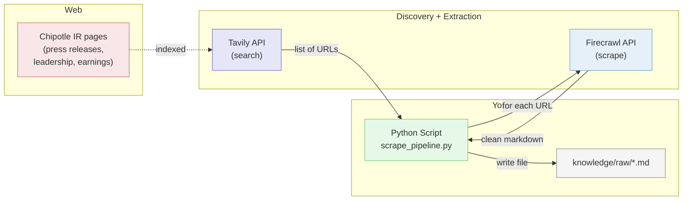

# Lesson 09: Scrape Pipeline

## Overview

How to collect unstructured web content into your portfolio project's knowledge base using AI-native scraping tools. You will use **Tavily** to search for relevant URLs and **Firecrawl** to turn each URL into clean markdown, then see the same pipeline collapse into a single Claude Code prompt using MCP servers.

## The Scenario

Your portfolio project requires a web scrape or document source for Milestone 02 — at least 15 markdown files in `knowledge/raw/` from 3+ different sites, automated via GitHub Actions. Before you can schedule anything, you need to know how to do the collection once, by hand. Today you learn the pattern: **search, scrape, save** — then see how MCP servers let Claude Code do the whole pipeline from a single prompt.

## What You Are Building

**How it fits together:**
- **Tavily:** An AI-native search API that returns a ranked list of URLs plus short content previews for any query. Replaces hand-picking URLs or writing a crawler.
- **Firecrawl:** A scrape API that takes a URL and returns clean markdown. Replaces BeautifulSoup, DOM inspection, and manual HTML parsing.
- **Python Script:** Ties them together in a loop — search, then scrape each result, then save.
- **`knowledge/raw/`:** The destination folder. These markdown files feed the knowledge-base path of your portfolio project.

## Learning Objectives

By the end of this lesson, you will be able to:
- **New:** Explain the difference between a chat-tool web search (Claude Code's `WebSearch`) and an API-based search (Tavily) — namely, which is for humans vs. pipelines
- **New:** Use Tavily to discover URLs for a domain, then Firecrawl to extract each URL as clean markdown
- **New:** Write scraped content as markdown files into a `knowledge/raw/` folder structured for Claude Code ingestion
- **New:** Install and invoke Firecrawl MCP and Tavily MCP inside Claude Code
- **New:** Recognize what an SDK is and why it is preferred over raw HTTP calls
- **Reinforce:** `.env` + `python-dotenv` secrets pattern (from the async Spotify tutorial)
- **Reinforce:** Create-repo-from-scratch workflow (from MP02/MP03)

## How the Class Works (One Session, 100 min)

| Part | What Happens |
|------|--------------|
| Part 01 | Scraping concepts: what it is, etiquette, API vs chat tool, Firecrawl + Tavily roles, MCP intro (~20 min, slides) |
| Part 02 | Python pipeline: Tavily search + Firecrawl scrape + save to `knowledge/raw/` (~25 min, live code, after a ~10 min setup block) |
| Part 03 | MCP upgrade: install Firecrawl + Tavily MCPs, replicate the pipeline via one prompt (~15 min) |
| Part 04 | Project connection: scrape at least one source into your portfolio project (~20 min) |

## Files in This Lesson

| File | Description |
|------|-------------|
| [mp04-tutorial.md](mp04-tutorial.md) | Step-by-step tutorial for the full session |
| [slides.md](slides.md) | MARP slide deck for Part 01 (scraping concepts) |

## Setup

Before class:
- Sign up for a free [Firecrawl](https://firecrawl.dev) account (GitHub sign-in, no card)
- Sign up for a free [Tavily](https://tavily.com) account (GitHub sign-in, no card)
- Optionally install the Firecrawl MCP and Tavily MCP servers in Claude Code (commands in [mp04-tutorial.md Step 04](mp04-tutorial.md#step-04-install-firecrawl-mcp-and-tavily-mcp)). Doing this before class keeps Part 03 on schedule.

In class, Step 00 of the tutorial walks you through creating the `scrape-pipeline` repo, setting up the venv, and creating the `.env` file.

## Key Concepts

### Web Scraping Without BeautifulSoup

In earlier courses you might have heard of BeautifulSoup — a Python library for parsing HTML tag-by-tag. It still exists, but hosted scraping services (Firecrawl, Tavily, Jina Reader) handle JS rendering, site structure changes, and content extraction far better than hand-written parsers. For the kind of content your knowledge base needs (press releases, bios, earnings, articles), a hosted API returns clean markdown in one call. If you want to learn BeautifulSoup for interview prep, go for it — but you do not need it for this project.

### Tavily vs. Claude Code's WebSearch

Both can find web content, but they are built for different consumers:

- **Claude Code `WebSearch`** is for **you**, reading in chat. It returns natural-language answers synthesized on the fly.
- **Tavily** is for your **pipeline**. It returns structured JSON (URLs, titles, content, scores) that a Python script or GitHub Action can loop over.

One-liner to memorize: *"If a cron job needs the answer, use the API. If a human needs the answer, use the chat tool."*

### Two Ways to Drive the Pipeline

You will see the same collection happen two ways:

| Approach | Pros | Cons |
|---|---|---|
| **Python + APIs** | Reproducible, runs in GitHub Actions, commits into your repo's history | More code, more setup |
| **MCP in Claude Code** | Single prompt, no Python, fast for ad-hoc collection | Requires interactive Claude Code session, not scheduled |

Your project will use both: MCP for exploratory collection during development, Python + GitHub Actions for the scheduled pipeline that Milestone 02 requires.

### The Pattern Transfers

MP03 taught API data collection: `request → parse → loop → save (CSV)`.
MP04 teaches web scraping: `search → extract → loop → save (markdown)`.

Different tools. Same shape. If you learned MP03, you already know MP04.

## Lesson Exercise

Complete the full tutorial in [mp04-tutorial.md](mp04-tutorial.md), push your finished `scrape-pipeline` repository to GitHub, and submit the GitHub repo link as your Lesson Exercises 09. Optionally, commit at least one new scraped source into your portfolio project repo's `knowledge/raw/`.
