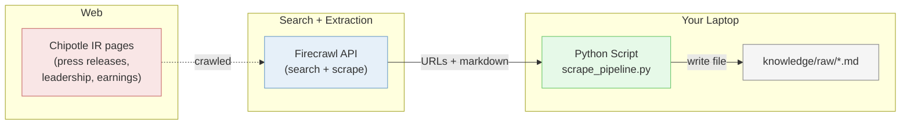

# Lesson 09: Scrape Pipeline

## Overview

How to collect unstructured web content into [your portfolio project](https://github.com/LMU-ISBA/isba-4715-f26/tree/main/project)'s knowledge base using an AI-native scraping API. You will use **[Firecrawl](https://firecrawl.dev)**'s unified search endpoint to find relevant URLs and turn each into clean markdown in a single call, then see the same pipeline collapse into a Claude Code prompt using the Firecrawl MCP server.

## The Scenario

Your portfolio project requires a web scrape or document source for Milestone 02 — at least 15 markdown files in `knowledge/raw/` from 3+ different sites, automated via GitHub Actions. Before you can schedule anything, you need to know how to do the collection once, by hand. Today you learn the pattern: **search, scrape, save** — then see how the Firecrawl MCP server lets Claude Code do the whole pipeline from a single prompt.

## What You Are Building

**How it fits together:**
- **Firecrawl:** An AI-native scraping API. One `search` call runs a web query and scrapes each result page as clean markdown. No separate search service needed.
- **Python Script:** Wraps the search call in a short script that writes each result to disk.
- **`knowledge/raw/`:** The destination folder. These markdown files feed the knowledge-base path of your portfolio project.

## Learning Objectives

By the end of this lesson, you will be able to:
- **New:** Explain the difference between a chat-tool web search (Claude Code's `WebSearch`) and an API-based search (Firecrawl) — namely, which is for humans vs. pipelines
- **New:** Use Firecrawl's unified `search` endpoint to discover URLs and extract markdown in one call
- **New:** Write scraped content as markdown files into a `knowledge/raw/` folder structured for Claude Code ingestion
- **New:** Install and invoke the Firecrawl MCP server inside Claude Code
- **New:** Recognize what an SDK is and why it is preferred over raw HTTP calls
- **Reinforce:** `.env` + `python-dotenv` secrets pattern (from the async Spotify tutorial)
- **Reinforce:** Create-repo-from-scratch workflow (from MP02/MP03)

## How the Class Works (One Session, 100 min)

| Part | What Happens |
|------|--------------|
| Part 01 | Scraping concepts: what it is, etiquette, Firecrawl's unified search, MCP intro (~20 min, slides) |
| Part 02 | Python pipeline: Firecrawl search + scrape + save to `knowledge/raw/` (~25 min, live code, after a ~10 min setup block) |
| Part 03 | MCP upgrade: install Firecrawl MCP, replicate the pipeline via one prompt (~15 min) |
| Part 04 | Project connection: scrape at least one source into your portfolio project (~20 min) |

## Files in This Lesson

| File | Description |
|------|-------------|
| [mp04-tutorial.md](mp04-tutorial.md) | Step-by-step tutorial for the full session |
| [slides.md](slides.md) | MARP slide deck source for Part 01 (scraping concepts) |
| [slides.html](slides.html) | Rendered HTML slides (open in a browser to present; arrow keys advance) |
| [slides.pdf](slides.pdf) | Rendered PDF slides (for distribution and printing) |

## Setup

No pre-class setup required. Step 00 of the tutorial walks you through everything in class: creating the `chipotle-scrape-pipeline` repo, signing up for Firecrawl (use your LMU `.edu` email to qualify for the [Student Program](https://www.firecrawl.dev/student-program) and the `STUDENTEDU` coupon for 20,000 credits), setting up the venv, creating the `.env` file, and installing the Firecrawl MCP server.

## Key Concepts

### Web Scraping Without BeautifulSoup

In earlier courses you might have heard of BeautifulSoup — a Python library for parsing HTML tag-by-tag. It still exists, but hosted scraping services (Firecrawl, Jina Reader) handle JS rendering, site structure changes, and content extraction far better than hand-written parsers. For the kind of content your knowledge base needs (press releases, bios, earnings, articles), a hosted API returns clean markdown in one call. If you want to learn BeautifulSoup for interview prep, go for it — but you do not need it for this project.

### Firecrawl search vs. Claude Code's WebSearch

Both can find web content, but they return different shapes:

- **Firecrawl's `search`** returns structured data (URLs, titles, descriptions, pre-scraped markdown) with a fixed schema every call. Your Python script loops over `response.data.web`.
- **Claude Code `WebSearch`** is a built-in tool that returns prose for Claude Code to read mid-conversation. The synthesis is fresh each call.

Both can run in automation — Claude Code has a `-p` flag and an official GitHub Actions integration. The real distinction is the output shape: a schema you can parse, versus prose the agent consumes. Pick the tool whose output matches the reader.

### Two Ways to Drive the Pipeline

You will see the same collection happen two ways:

| Approach | Pros | Cons |
|---|---|---|
| **Python + Firecrawl SDK** | Fixed response schema, direct control over parameters, runs anywhere Python does | More code, more setup |
| **MCP in Claude Code** | Single prompt, no Python, fast for ad-hoc collection | Output depends on Claude Code's judgment each run |

Your project will use both: MCP for exploratory collection during development, Python + GitHub Actions for the scheduled production pipeline Milestone 02 requires.

### The Pattern Transfers

MP03 taught API data collection: `request → parse → loop → save (CSV)`.
MP04 teaches web scraping: `search → extract → loop → save (markdown)`.

Different tools. Same shape. If you learned MP03, you already know MP04.

## Lesson Exercise

Complete the full tutorial in [mp04-tutorial.md](mp04-tutorial.md), push your finished `chipotle-scrape-pipeline` repository to GitHub, and submit the GitHub repo link as your Lesson Exercises 09. Optionally, commit at least one new scraped source into your portfolio project repo's `knowledge/raw/`.
