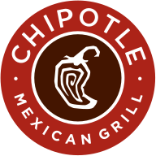

<!-- _class: accent -->

# Scrape Pipeline

**Lesson 09** · ISBA 4715

---

# Agenda

| | Part | What |
|---|------|------|
| 1 | **Scraping Concepts** | What it is, etiquette, the tools we'll use *(slides)* |
| 2 | **Python Pipeline** | Firecrawl search + scrape, saving to `knowledge/raw/` *(live code)* |
| 3 | **MCP Upgrade** | Claude Code as the pipeline *(demo)* |
| 4 | **Your Project** | Scrape at least one source into your repo |

---

<!-- _paginate: false -->

# How did Google build its first index?

  

Before anyone wrote an API for the web...

---

# How did Google build its first index?

  

Before anyone wrote an API for the web...

**Web scraping** — reading pages programmatically.

---

<!-- _class: dark -->

# Web Scraping

> Gathering data from websites **without an API** and **without a human clicking around in a browser**

---

<!-- _class: dark -->

# Why Scrape?

  

🚫

No API exists for this data

  

💳

The API is paywalled

  

📰

Constantly-changing list (press releases, bios, news)

  

🤖

You want to automate something a human would do

---

# Etiquette and Caveats

| Rule | Why |
|---|---|
| Check `robots.txt` | Sites declare what bots can crawl |
| Rate limit — `time.sleep()` | Don't hammer the server |
| Respect Terms of Service | Legal + ethical obligation |
| Expect layout changes | HTML is not a stable contract |
| Be mindful of PII | Don't scrape what people did not consent to share |

---

<!-- _class: accent -->

# Where does scraped data go in THIS project?

---

<!-- _class: accent -->

# Where does scraped data go?

  
MP03 (API)<small>request → CSV → SQL warehouse</small>

---

<!-- _class: accent -->

# Where does scraped data go?

  
MP03 (API)<small>request → CSV → SQL warehouse</small>

  
→

  
MP04 (Scrape)<small>extract → markdown → knowledge/raw/</small>

---

<!-- _class: accent -->

# Where does scraped data go?

  
MP03 (API)<small>request → CSV → SQL warehouse</small>

  
→

  
MP04 (Scrape)<small>extract → markdown → knowledge/raw/</small>

These feed your **knowledge base** — the unstructured side of your portfolio project.

---

# One API, Search + Extract

  
🔍 query<small>"Chipotle earnings"</small>

  
→

  
<small>Firecrawl</small>

  
→

  
📄 URLs + markdown<small>5 results, each scraped</small>

**Older tools split this into two calls** — one service for search, another for scraping. Firecrawl's `search` endpoint does both in one round-trip.

---

<!-- _class: dark -->

# Firecrawl vs. Claude Code's WebSearch

  
  vs.
  

| Firecrawl (API) | WebSearch (Claude Code tool) |
|---|---|
| Returns structured data (URLs, titles, markdown) | Returns prose for the agent to read |
| Designed for programmatic pipelines | Built into Claude Code conversations |
| Same response schema every call | Different synthesized text each call |
| Full control: filters, domains, depth | Whatever the tool decides |

> Cron jobs need structured data to parse. Humans need readable prose. Pick the right tool for the reader.

---

# Firecrawl — Search + Scrape API

  

  
🔍 query<small>"Chipotle earnings"</small>

  
→

  
<small>Firecrawl</small>

  
→

  
📄 List of results<small>each with url + markdown</small>

No BeautifulSoup. No `select` or `find`. No DOM inspection.

---

<!-- _paginate: false -->

# Last Year We Taught BeautifulSoup

- Parse HTML tag-by-tag
- Hunt for the right CSS selector
- Break every time the site redesigns

---

# Last Year We Taught BeautifulSoup

- Parse HTML tag-by-tag
- Hunt for the right CSS selector
- Break every time the site redesigns

**This year we don't.** Firecrawl does all three in one call, and handles JavaScript rendering too. If you want BeautifulSoup for interview prep, read the docs — you do not need it for this project.

---

# Build vs. Buy — Scraping Edition

| Problem | Don't | Do |
|---|---|---|
| 🔍 Find + scrape URLs | Write a crawler + parser | **Firecrawl** |
| 🖱️ Click through a login | Write a bot | Playwright |

---

<!-- _class: dark -->

# The Pipeline

  
<small>Firecrawl search</small>

  
→

  
📄<small>URLs + markdown</small>

  
→

  
📁<small>knowledge/raw/</small>

One API does the finding and the extracting. Your script saves the output.

---

<!-- _class: accent -->

# Now the Upgrade: MCP

What if Claude Code could call Firecrawl **directly**, without you writing Python?

---

<!-- _class: accent -->

# Now the Upgrade: MCP

  
💬<small>your prompt</small>

  
→

  
🤖 Claude Code<small>reads the prompt</small>

  
→

  
🔌 Firecrawl MCP<small>search + scrape</small>

  
→

  
📁<small>files written</small>

**MCP servers** (Model Context Protocol) extend Claude Code with new tools. Install one, and Claude Code can use it inside any prompt.

---

<!-- _class: dark -->

# Python vs. MCP

### 🐍 Python (Part 02)

- ~30 lines of SDK calls
- Loops, file writes
- Version-controlled
- Runs in GitHub Actions

### 💬 MCP (Part 03)

> "Find 5 URLs about Chipotle's recent earnings and save each as markdown in `knowledge/raw/`."

**Same result. No code.**

---

# Today's Demo Domain: Chipotle IR

  

  

📈

<strong>IR = Investor Relations</strong> — shareholder-facing content

  

📰

Press releases, bios, earnings, filings

  

🔓

Legally required to be accessible

  

✨

Great fit for a knowledge base

---

# Accounts You Need

  

| Service | URL | Free Tier |
|---|---|---|
| Firecrawl | [firecrawl.dev](https://firecrawl.dev) | 500 credits/month |
| **Student Program** | [firecrawl.dev/student-program](https://www.firecrawl.dev/student-program) | **20,000 credits** with `.edu` email |

GitHub sign-in, no card. Apply to the student program after you sign up — it is approved in under a day.

---

# Your Project Needs This

  

🎯

Milestone 02: <strong>≥15 sources</strong> from 3+ sites

  

🔗

Pattern works for any URL in a browser

  

💼

Your job posting says what content matters

  

📚

Feeds your knowledge base wiki

---

# The Pattern Transfers

  
MP03 (APIs)<small>request → parse → loop → save (CSV)</small>

  
↔

  
MP04 (Scraping)<small>search → extract → loop → save (markdown)</small>

Different tools. Same shape. If you learned MP03, you already know MP04.

**Next up:** code it together.
