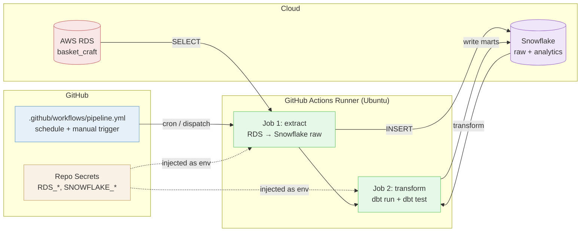

# Lesson 10: Schedule the Pipeline with GitHub Actions

## Overview

How to take a working pipeline and run it on a schedule in the cloud, without your laptop being open. You will take the **Basket Craft pipeline you built in MP02** (RDS MySQL → Snowflake → dbt) and put it on a GitHub Actions schedule. Once you see the pattern on a familiar pipeline, you transfer it to the API and scrape pipelines in your portfolio project.

## The Scenario

Your portfolio project's Milestone 02 requires both extraction pipelines to run "automated via GitHub Actions on a schedule." Up to now, every pipeline you have built runs on your laptop, when you remember to run it. That is fine for development, but a portfolio piece a hiring manager looks at should refresh on its own. Today you wire the MP02 pipeline to a `cron` schedule and a manual trigger, watch it run on GitHub's servers, and verify Snowflake updated.

## What You Are Building

**How it fits together:**
- **Workflow file:** A YAML file in `.github/workflows/` defines when the pipeline runs (`schedule:` for cron, `workflow_dispatch:` for manual) and what it does (jobs and steps).
- **Repo secrets:** The same values from your local `.env` file, stored encrypted in GitHub. The workflow injects them as environment variables at run time. Nothing committed.
- **Runner:** A fresh Ubuntu VM that GitHub spins up for each run. It checks out your repo, installs Python and dbt, runs your scripts, then disappears.
- **Same source, same destination:** RDS and Snowflake do not change. Only the location of the script execution moves from your laptop to GitHub's servers.

## Learning Objectives

By the end of this lesson, you will be able to:
- **New:** Read and write a GitHub Actions workflow YAML file
- **New:** Manage repository secrets via the `gh` CLI
- **New:** Trigger a workflow manually with `workflow_dispatch` and on a schedule with `cron`
- **New:** Generate a `profiles.yml` for dbt at runtime so credentials live in secrets, not in a file
- **New:** Read GitHub Actions logs to debug a failed run
- **Reinforce:** `.env` + `env_var()` pattern from MP02
- **Reinforce:** Loader script and dbt project from MP02

## How the Class Works (One Session, ~60 min)

| Part | What Happens |
|------|--------------|
| Part 01 | GitHub Actions concepts: workflows, jobs, triggers, secrets (~10 min) |
| Part 02 | Push MP02 secrets to GitHub and write the workflow file (~25 min, live code) |
| Part 03 | Trigger manually, debug, then add the cron schedule (~15 min) |
| Part 04 | Project connection: apply the same pattern to your portfolio API and scrape pipelines (~10 min) |

## Files in This Lesson

| File | Description |
|------|-------------|
| [tutorial.md](tutorial.md) | Step-by-step tutorial for the full session |

## Setup

No new tools to install. You need:
- **The MP02 `basket-craft-pipeline` repo** on your laptop with a working loader script, a `basket_craft/` dbt project, a populated `.env`, and a `requirements.txt`. If `python loader.py` and `dbt run` both succeed locally, you are ready.
- **The `gh` CLI** authenticated against GitHub. You set this up in MP01. Run `gh auth status` to confirm.
- **A public GitHub repo** for your MP02 project. GitHub Actions is free for public repos with no minute cap.

## Key Concepts

### Workflow, Job, Step

A **workflow** is one YAML file in `.github/workflows/`. It defines one or more **jobs** (each runs on its own fresh VM) and each job runs a list of **steps** (each is either a `run:` shell command or a prebuilt `uses:` action). Workflows run when a **trigger** fires: a push, a pull request, a `cron` schedule, or a `workflow_dispatch` button click.

### `workflow_dispatch` Before `schedule`

Always add `workflow_dispatch:` (the manual "Run workflow" button) before you add `schedule:`. You want to test on demand, not wait for the next cron tick. Once the manual run is green, add the schedule.

### Secrets Are Not Variables

Repo secrets are encrypted, write-only, and masked in logs. You inject them with `${{ secrets.NAME }}` and reference them in `env:` blocks. They are not for non-secret config like `SNOWFLAKE_DATABASE` — but it is fine to put non-secrets in secrets too, and most teams do, because it keeps one source of truth.

### Generating `profiles.yml` at Runtime

In MP02, your `~/.dbt/profiles.yml` lives outside the repo so secrets are not committed. The runner is fresh every run, so there is no `~/.dbt/` to read. The standard pattern: set `DBT_PROFILES_DIR=.` and have the workflow `cat` a small `profiles.yml` into the working directory using secret-backed env vars. Same `env_var()` calls in dbt, just with the file generated on the fly.

### The Pattern Transfers

MP02 taught you the loader and dbt. This lesson teaches you the wrapper that schedules them. The wrapper does not care whether the source is RDS, an API, or a Firecrawl call. Your portfolio gets two of these workflow files: one for the API extract, one for the scrape extract. Same shape, different `run:` line.

## Lesson Exercise

Complete the full tutorial in [tutorial.md](tutorial.md), confirm at least one green scheduled run in your MP02 repo's **Actions** tab, and submit the GitHub repo link. Then add a workflow file to your portfolio repo for at least one of your two pipelines before Milestone 02.
