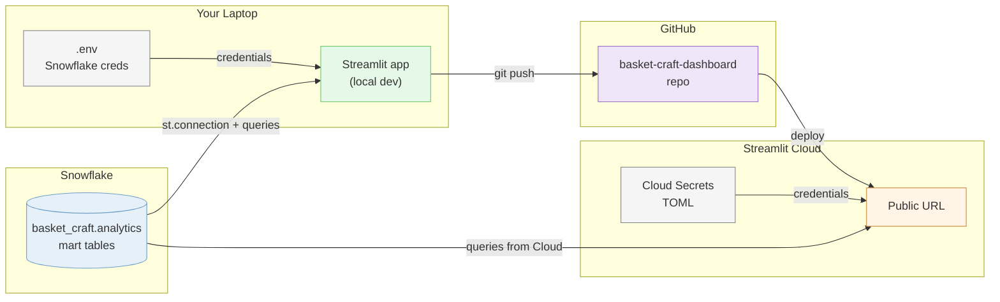

# Lesson 10: Streamlit Dashboard

## Overview

A single-session lesson (100 min). Build and deploy a public Streamlit dashboard against the basket_craft Snowflake mart you built in MP02. The dashboard answers Maya's merchandising questions using **[Streamlit](https://streamlit.io)** for the UI, your `.env` from MP02 for the Snowflake connection, and **[Streamlit Community Cloud](https://streamlit.io/cloud)** for hosting. By the end of class, you have a public URL anyone can visit.

## The Scenario

In MP02 Step 25, Maya — the Head of Merchandising at Basket Craft — gave you four questions about products, bundles, refund rates, and cohort buying patterns. You designed the dbt mart around her questions. Today you build the dashboard that surfaces the answers. The first two questions (top products by revenue, what gets bought together) are answered directly in the in-class build; the other two are extension territory.

## What You Are Building

**How it fits together:**
- **`.env` (local) / Cloud Secrets (deployed):** the same seven Snowflake values, stored two places. Local file stays gitignored; Cloud-side text box uses [TOML format](https://toml.io).
- **Streamlit app:** runs locally during development (`streamlit run`), deploys to Cloud on every `git push`.
- **Snowflake mart:** queried from both local dev and Cloud-deployed app. Mart structure unchanged from MP02.
- **Public URL:** what you submit and what you'd share with a stakeholder.

The dashboard itself has four sections, walking the analytical arc top to bottom:

| Section | Maya question it answers | Step |
|---|---|---|
| KPI scorecards (revenue / orders / AOV / items sold) | "Where are we now?" | 02 |
| Revenue trend (line chart, date filter) | "How did we get here?" | 03 |
| Top products by revenue (bar chart) | "Which products drove the most revenue?" | 04 |
| Bundle finder (pick a product, see co-purchases) | "Which products get bought together? Should we create bundles?" | 05 |

## Learning Objectives

By the end of this lesson, you will be able to:

- **New:** Build a multi-section Streamlit dashboard with KPI metrics, a line chart, a bar chart, and a filterable table
- **New:** Connect Streamlit to a Snowflake warehouse using `.env` locally and Streamlit Cloud's Secrets box (TOML) in production
- **New:** Apply the cached query pattern (`ttl="10m"`) so dashboard interactions don't re-query Snowflake on every widget change
- **New:** Deploy a Streamlit app to Streamlit Community Cloud with a public URL backed by warehouse credentials
- **New:** Recognize when a paste-able Claude Code prompt should describe an outcome (build me a chart of X) versus when it should describe implementation (which it shouldn't)
- **New:** Validate dashboard numbers against direct SQL queries instead of trusting agent-generated SQL blindly
- **Reinforce:** SQL aggregates from Lessons 01–02 (`SUM`, `COUNT`, `AVG`) reappearing as KPI metrics with month-over-month deltas
- **Reinforce:** `COUNT(DISTINCT)` and JOIN patterns from Lesson 03 reappearing in the bundle finder's self-join
- **Reinforce:** Snowflake connection params from MP02 — same seven values, new envelope
- **Reinforce:** `.env` + gitignore-secrets discipline from MP03/MP04

## How the Class Works (One Session, 100 min)

| Time | Block | What Happens |
|------|-------|--------------|
| 0–15 | Concepts (slides) | DC ACT recap, Streamlit anatomy, Maya as stakeholder |
| 15–30 | Step 00 (Setup) | Repo, `.env` with Snowflake credentials, Streamlit Cloud signup |
| 30–45 | Step 01 (Connect) | Two narrow Claude Code prompts: empty dashboard → Snowflake smoke test |
| 45–60 | Step 02 (KPIs) | Four metric cards with month-over-month deltas |
| 60–70 | Step 03 (Trend) | Line chart of revenue with a date filter |
| 70–80 | Step 04 (Top products) | Bar chart of revenue by product |
| 80–85 | Step 05 (Bundle finder) | Product selector + co-purchase table with CSV download |
| 85–95 | Step 06 (Deploy) | Push to GitHub, configure Streamlit Cloud, public URL live |
| 95–100 | Wrap | Submission reminders, preview the May 11 final interview |

## Files in This Lesson

| File | Description |
|------|-------------|
| [tutorial.md](tutorial.md) | Step-by-step tutorial for the in-class build |

## Setup

No pre-class setup required beyond confirming your MP02 Snowflake account is still active and the basket_craft `analytics` schema is still queryable. The night before, log into Snowsight and run a quick `SELECT` on a dimension table to verify.

Step 00 of the tutorial walks you through everything else in class: creating the `basket-craft-dashboard` repo, signing up for Streamlit Community Cloud, and dropping your Snowflake credentials in `.env`. You don't run terminal commands yourself — Claude Code handles the venv, the package installs, `git`, and `streamlit run`.

## Key Concepts

### Streamlit's Run Loop

Streamlit re-runs your script top-to-bottom on every interaction (slider drag, dropdown change, button click). That's the framework's core abstraction: state lives in widgets, not in your code. Without caching, every interaction would re-query Snowflake. With caching (the `ttl` parameter on `conn.query()` or the `@st.cache_data` decorator), results are reused until inputs change. For a dashboard with four queries plus a filter, caching is the difference between snappy and sluggish.

### Outcome-Shaped Prompting

The prompts in this lesson describe outcomes, not implementations. *"Add a bar chart showing the top products by revenue. Have it respect the date filter."* Not *"Use `st.bar_chart` with a `LIMIT 10` query joining `fct_order_items` to `dim_products` and group by `product_name`."* The narrower prompt forces the student to know the API; the outcome-shaped prompt lets Claude Code pick the API surface. The lesson also shows the trade-off: open-ended prompts ("help me design my dashboard") trigger the Superpowers brainstorming skill. When you already know what you want, narrow prompts that name a specific outcome avoid the brainstorm and ship faster.

### You Own the Numbers

Claude Code generates SQL that looks right but isn't always right. Wrong joins, mis-applied filters, off-by-one date boundaries — these all produce *a* number, just not the right one. Before trusting any chart, validate the result with a SQL query directly in Snowsight. The dashboard is your work product, not the agent's. A bad number a stakeholder makes a decision on is a bad call with your name attached.

### Same Seven Credentials, Two Storage Locations

Local development reads from `.env` (gitignored). Streamlit Cloud reads from a TOML-formatted Secrets box that lives in Cloud's encrypted backend. Same seven values, different envelope. This is the same pattern MP04 used for GitHub Actions secrets — local files for development, platform-encrypted store for production. Source code never sees credentials.

### Maya Continues from MP02

The dashboard isn't a new exercise; it's the completion of the narrative MP02 started. Maya, the Head of Merchandising, asked four questions in MP02 Step 25. You designed the dbt mart around them. Today the dashboard surfaces the answers. A mart designed for Maya, queried for Maya, presented to Maya. That stakeholder continuity is what makes the lesson cohere across mini-projects.

### DC ACT Lives at the Part Level

The chart progression (KPIs → trend → top products → bundle finder) maps onto the descriptive→diagnostic→action arc you've used since Lesson 01. KPIs and trend are descriptive ("what happened"). Top products is diagnostic ("which products drove it"). The bundle finder is the Act — it produces a downloadable CSV a buyer can use to design a bundle promotion. Most production dashboards mix Communicate-only sections (situational awareness) with Act-enabling sections (drill-downs with export). The lesson teaches you to recognize which is which.

## Lesson Exercise

Complete the full tutorial in [tutorial.md](tutorial.md). Submit your `basket-craft-dashboard` repo URL and your Streamlit Cloud URL on Brightspace.

Your `basket-craft-dashboard` repo should contain the Streamlit app with all four dashboard sections, a `requirements.txt` with pinned package versions, a `.gitignore` that excludes `.env`, and a `README.md` with the live Streamlit Cloud URL pinned at the top.

It must NOT contain `.env`. If you accidentally commit it, rotate the Snowflake password immediately and scrub history before pushing further.
