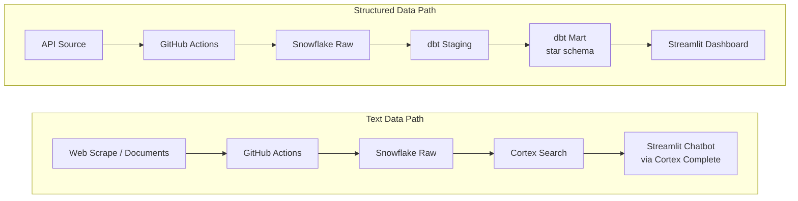

# Portfolio Project: Analytics Engineering

You find a real job posting for a role you'd actually apply to, then build an end-to-end data pipeline and analytics project that demonstrates you can do what the job requires. The project is worth 30% of your course grade and lives in a public GitHub repo you can show to employers.

## Timeline & Milestones

| Milestone | Due | What's Due |
|---|---|---|
| Proposal | Apr 13 at 9:55 AM | Proposal PDF, job posting PDF, GitHub repo, Snowflake account |
| Milestone 01: Extract, Load & Transform | Apr 27 at 9:55 AM | API source loaded, dbt models, GitHub Actions pipeline, pipeline diagram |
| Milestone 02: Present & Polish | May 4 at 9:55 AM | Web scrape source loaded, Streamlit dashboard, RAG chatbot, slides, README, ERD |
| Final Interview | May 11 | Whiteboard walkthrough, project demo |

Your public GitHub repo is your submission. Submit the repo URL to Brightspace by each due date.

## What You're Building

You'll build a pipeline that moves data from two sources into Snowflake, transforms it through raw, staging, and mart layers using dbt, and surfaces it through a Streamlit dashboard and a RAG chatbot, all automated via GitHub Actions.

The dashboard answers "how much" and "what happened" using structured data. The chatbot answers "what does this mean" and "tell me about X" using text data.

## Tech Stack

| Layer | Tool |
|---|---|
| IDE | [Cursor](https://www.cursor.com) |
| AI Development | [Claude Code](https://code.claude.com/docs/en/overview) + [Superpowers](https://github.com/obra/superpowers) |
| Version Control | [Git](https://git-scm.com) + [GitHub](https://github.com) (public repo) |
| Data Warehouse | [Snowflake](https://www.snowflake.com) (trial account, AWS US East 1) |
| Transformation | [dbt](https://www.getdbt.com) |
| Orchestration | [GitHub Actions](https://docs.github.com/en/actions) (scheduled) |
| Dashboard | [Streamlit](https://streamlit.io) (deployed to Streamlit Community Cloud) |
| RAG Chatbot | [Snowflake Cortex Search](https://docs.snowflake.com/en/user-guide/snowflake-cortex/cortex-search/cortex-search-overview) + [Cortex Complete](https://docs.snowflake.com/en/sql-reference/functions/complete-snowflake-cortex) |

These are the same tools from the mini-projects. No new setup required.

## Your Job Posting & Data Sources

### Job Posting

Find a real job posting for a junior analytics engineer, data engineer, or data analyst role. Your project must target the skills that posting lists.

Save the posting as a PDF. You'll submit it with your proposal and reference it in your final interview to connect what you built to what the role requires.

### Data Sources

Your pipeline must pull from **2 or more data sources of different types**:

- At least one **API** (REST, GraphQL, or a Python client wrapping one)
- At least one **web scrape or document scrape** (Firecrawl, web scraping APIs, MCP servers, PDFs, and other documents all count)

All sources must be automated via **GitHub Actions on a schedule**.

The sources you propose are tentative. You can change them as the project evolves. The proposal just shows you've thought through plausible sources, not that you're committed to them.

## Proposal (10 pts) - Due Mon, Apr 13 at 9:55 AM

Use the [proposal template](proposal-template.md) to create your 1-page proposal. Export it as a PDF. Save the job posting as a separate PDF. Commit both to `docs/` in your repo. Submit your repo URL to Brightspace.

| # | Deliverable | Pts | Details |
|---|---|---|---|
| 1 | Project proposal + job posting PDF | 5 | Structured 1-page proposal PDF (`docs/proposal.pdf`) + job posting PDF (`docs/job-posting.pdf`). Both committed to your repo. |
| 2 | GitHub repo initialized | 3 | Public repo, proper `.gitignore`, directory structure, `CLAUDE.md` with project context |
| 3 | Snowflake account | 2 | Trial account in AWS US East 1 (required for Cortex Search). Credentials stored securely, NOT in repo. Screenshot of account region in `docs/`. |

## Milestone 01: Extract, Load & Transform (35 pts) - Due Apr 27 at 9:55 AM

API source extracted, loaded to Snowflake, and transformed through dbt. Submit your repo URL to Brightspace.

| # | Deliverable | Pts | Details |
|---|---|---|---|
| 4 | Source 1 (API) extraction + load to Snowflake raw | 10 | Python script, loads to Snowflake raw schema, env vars for credentials, scheduled via GitHub Actions |
| 5 | dbt project (staging + mart models) | 15 | Star schema in Snowflake: staging models with tests, fact table(s) + dimension table(s) for analysis |
| 6 | GitHub Actions pipeline | 5 | Source 1 automated on a schedule or manual trigger. Graded on pipeline completeness and secrets management. |
| 7 | Data pipeline diagram | 5 | All layers (sources → raw → staging → mart → dashboard/chatbot), every tool labeled. Open format (Mermaid, draw.io, Excalidraw, etc.). Included in README |

## Milestone 02: Present & Polish (55 pts) - Due May 4 at 9:55 AM

Add your second data source, build the dashboard and chatbot, and polish everything for your portfolio. Submit your repo URL and slides PDF to Brightspace.

| # | Deliverable | Pts | Details |
|---|---|---|---|
| 8 | Source 2 (web scrape/docs) extraction + load to Snowflake raw | 10 | Different source type from source 1. Scheduled via GitHub Actions. |
| 9 | Streamlit dashboard (deployed) | 15 | Connected to Snowflake mart tables, descriptive + diagnostic analytics, interactive. Public URL |
| 10 | Presentation slides (PDF) | 10 | Descriptive + diagnostic insights, recommendations. Graded on data storytelling principles (see Minimum Requirements). Portfolio artifact, not presented in final interview. Submitted as PDF to Brightspace. |
| 11 | RAG chatbot in Streamlit (deployed) | 10 | Cortex Search + Cortex Complete. Answers domain questions from your web-scraped/document corpus. Same Streamlit app, separate tab. Public URL |
| 12 | README.md | 5 | Use the [README template](readme-template.md). Project overview, tech stack, pipeline setup, ERD, pipeline diagram, insights summary |
| 13 | ERD (star schema) | 3 | Generated by Claude Code from dbt models. Fact + dimension tables. Included in README |
| 14 | Commit history + repo structure | 2 | Frequent meaningful commits, clean directory structure |

**Total: 100 points (30% of course grade)**

## Grading

Meeting all minimum requirements earns a B-range grade. An A requires going beyond the minimums with depth, polish, and analytical insight.

| Grade | Description |
|---|---|
| A | Exceeds minimums with depth, polish, and insight. An employer would be impressed by this repo. |
| B | Meets all minimums solidly. Functional and complete but doesn't go beyond. |
| C | Meets most minimums but has gaps: missing tests, shallow analysis, broken deployment. |
| D | Significant gaps: incomplete pipeline, no deployment, minimal effort. |
| F | Not submitted or fundamentally incomplete. |

### Minimum Requirements

Full checklists for the four highest-stakes deliverables. Other deliverables are graded against the descriptions in the milestone tables above.

#### dbt Project (15 pts)

- At least one staging model per source (cleaning, renaming, type casting)
- At least one fact table and at least one dimension table
- Star schema design with relationships between fact and dimension tables
- At least one dbt test passing
- `dbt run` and `dbt test` execute without errors
- Models materialized in Snowflake

#### Streamlit Dashboard (15 pts)

- Connected to Snowflake mart tables
- At least one descriptive analytics view (what happened?)
- At least one diagnostic analytics view (why did it happen?)
- At least one interactive element (filter, selector, or tab)
- Deployed to Streamlit Community Cloud with public URL

#### RAG Chatbot (10 pts)

- Cortex Search service created on web-scraped/document text data
- Cortex Complete used for answer generation
- Working chat UI in Streamlit (`st.chat_input`, `st.chat_message`)
- Returns relevant answers based on the scraped corpus
- Deployed as a tab in the same Streamlit app (public URL)

#### Presentation Slides (10 pts)

- At least one descriptive analytics insight with Takeaway Title and supporting visual
- At least one diagnostic analytics insight with Takeaway Title and supporting visual
- Callout on each visual that highlights the key evidence
- Actionable recommendation: [Action] → [Expected outcome]
- Designed as a portfolio artifact, ready to use in a real job interview

**Data Storytelling Principles (Lesson 05 refresher):**

- **Takeaway Titles:** State the insight, not the category. "Email delivers 9x more conversions per dollar" not "Marketing Channel Performance." If someone reads only the title, they should know what happened.
- **Callouts:** Circle, arrow, or highlight that draws the eye to the key evidence in the visual.
- **Recommendation format:** [Action] → [Expected outcome]. Specific and actionable. "Shift 40% of display budget to email → projected 200+ additional conversions" not "improve marketing."

### Quality Rubric

Beyond the minimums, grading rewards quality across these themes:

**Analytical depth:** Are the business questions interesting and relevant to the job posting? Does the diagnostic analysis dig into root causes, or just show another chart? Are the recommendations actionable and specific?

**Technical quality:** Is the star schema well-designed? Are dbt models clean and tested? Is the pipeline reliable and well-organized? Is the code documented?

**Polish and UX:** Is the dashboard layout thoughtful (labels, color, flow)? Is the chatbot responsive and helpful? Are the slides visually clear and story-driven? Would you demo this confidently in a job interview?

**Documentation:** Does the README explain the project clearly to someone seeing it for the first time? Is the pipeline diagram accurate and complete? Does the ERD match the actual dbt models?

## Getting Started

No example projects are provided. Use Claude Code with the Superpowers brainstorming skill to develop your project idea.

1. Find and save your job posting as a PDF.
2. Open Claude Code and ask it to help you brainstorm project ideas. The Superpowers brainstorming skill will guide you through a structured conversation. Reference the job posting by file path, screenshot, or copy-paste to give it context.
3. Explore: what skills does the role require? What data would demonstrate those skills? What questions would you want to answer?

Your proposal locks in the job posting and project framing, but data sources are tentative and can evolve as you learn more in MPs 02-04.

## Policies

- **Individual project.** All work must be your own.
- **Late penalty.** 10% deduction per day late.
- **AI usage.** Claude Code is your primary development tool. You are expected and encouraged to use it for scaffolding, debugging, and building. But you must be able to explain every component in your final interview. If you can't explain it, you don't get credit for it.
- **Public repo.** This is a portfolio piece. Employers will see it.
- **No credentials in the repo.** Use `.env` files and `.gitignore`. Environment variables for all secrets. No database passwords, API keys, or Snowflake credentials committed to git.
